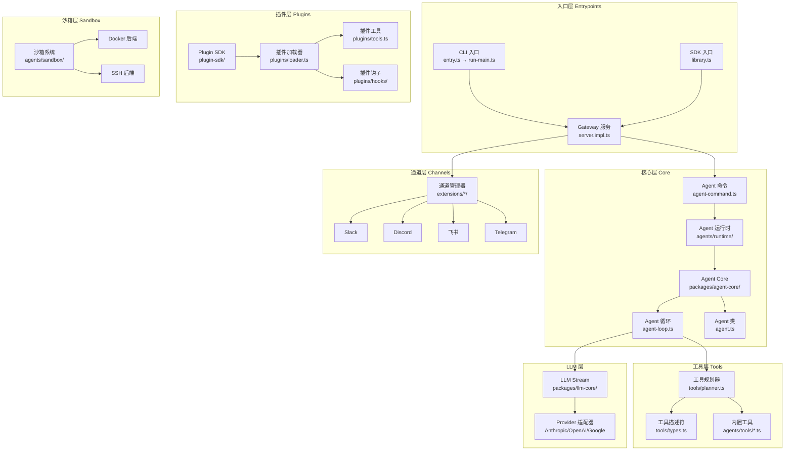
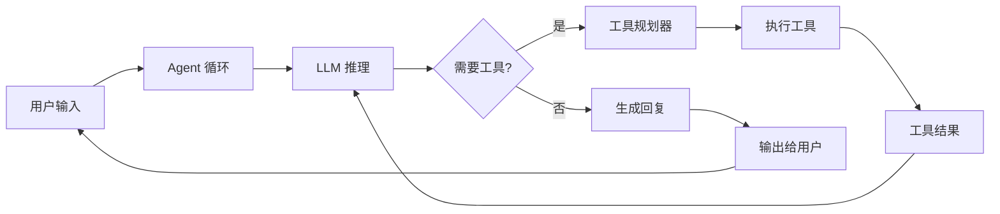

# OpenClaw From Scratch

> 基于 OpenClaw 源码深度剖析，带你从零掌握多通道 AI 网关与 Agent 系统的核心设计

---

## 本书简介

**OpenClaw** 是一个生产级的多通道 AI 网关，内置强大的 Agent 运行时。它能够连接多种 IM 平台（Slack、Discord、飞书、Telegram 等），运行 AI Agent，执行工具调用，管理会话，并支持通过插件系统无限扩展。

本教程以 **OpenClaw** 的真实源码为蓝本，系统性地拆解一个生产级多通道 Agent 系统的完整架构。从最基础的 CLI 入口到复杂的 Agent 循环，从工具系统到 LLM 集成，从网关消息分发到插件 SDK，每一章都配有：

- **Mermaid 架构图** —— 直观理解系统设计
- **关键源码分析** —— 直接来自 OpenClaw 的真实代码
- **设计决策解读** —— 理解为什么这样设计
- **动手实践指引** —— 第 11 章提供完整可运行的最小实现

---

## 目录

| 章节 | 标题 | 内容概要 | 难度 |
|------|------|---------|------|
| [第 1 章](ch01-introduction/README.md) | **认识 OpenClaw** | 什么是 OpenClaw、核心能力、整体架构俯瞰、项目速览 | ⭐ |
| [第 2 章](ch02-project-skeleton/README.md) | **项目骨架与入口设计** | CLI 入口、Bootstrap 流程、模块化架构、启动流程全景 | ⭐⭐ |
| [第 3 章](ch03-agent-core/README.md) | **Agent 核心抽象** | Agent 类设计、消息类型系统、运行时依赖、状态管理 | ⭐⭐⭐ |
| [第 4 章](ch04-agent-loop/README.md) | **Agent 核心循环** | LLM 交互循环、工具调用执行、事件流、系统提示词构建、上下文压缩 | ⭐⭐⭐ |
| [第 5 章](ch05-tool-system/README.md) | **工具系统** | 工具描述符、可用性规划、协议转换、工具执行编排 | ⭐⭐⭐ |
| [第 6 章](ch06-llm-integration/README.md) | **LLM 集成** | Provider 抽象层、流式处理、Token 用量归一化、模型管理 | ⭐⭐⭐ |
| [第 7 章](ch07-gateway-messaging/README.md) | **网关与消息分发** | WebSocket 网关、消息路由、Agent 分发、Channel 集成 | ⭐⭐⭐ |
| [第 8 章](ch08-plugin-sdk/README.md) | **插件 SDK** | 插件注册机制、工具注册、生命周期钩子、Provider 扩展 | ⭐⭐⭐ |
| [第 9 章](ch09-sandbox-security/README.md) | **沙箱与安全** | Sandbox 架构、Docker/SSH 后端、工具权限策略、审批流程 | ⭐⭐ |
| [第 10 章](ch10-config-session/README.md) | **配置与会话** | 配置系统、Session 管理、模型选择、上下文窗口管理 | ⭐⭐ |
| [第 11 章](ch11-minimal-agent/README.md) | **从零搭建你的最小 OpenClaw** | 完整可运行代码 + 扩展方向 | ⭐⭐⭐ |
| [附录](appendix-concepts/README.md) | **核心概念速查表** | 关键概念一页速查 | ⭐ |

---

## 整体架构俯瞰

## 核心 Agent 循环

## 学习路径

- **初学者**：第 1 → 3 → 4 → 5 → 11 章（掌握核心概念 + 动手实践）
- **进阶者**：按顺序通读全部 11 章
- **实践者**：先看第 11 章跑通最小 Agent，再回头深入各章

## 前置知识

- 基本的 **TypeScript** 语法（类型、异步、泛型）
- 对 **LLM** 的基本了解（什么是 API call、什么是 tool use）
- 基本的 **Node.js** 概念