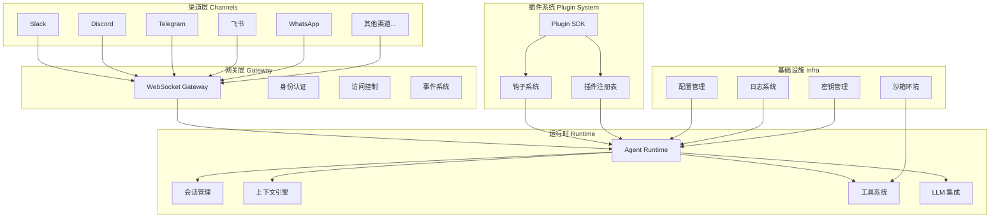
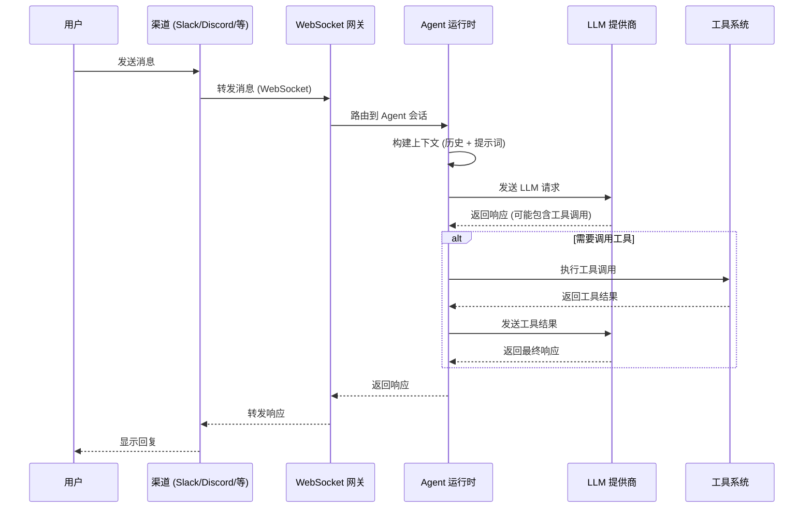
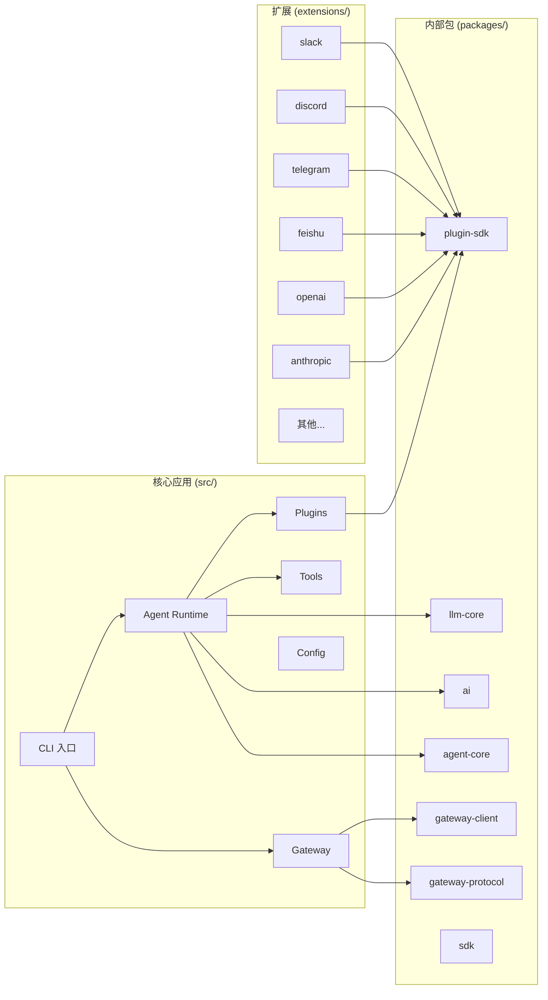

# 第一章：OpenClaw 介绍

## 1.1 什么是 OpenClaw

**OpenClaw** 是一个多通道 AI 网关（Multi-channel AI Gateway），内置可扩展的 Agent 运行时。它不仅仅是一个 AI 聊天机器人入口，更是一个完整的 AI 基础设施平台，允许用户通过多种即时通讯渠道与 AI Agent 交互，同时提供丰富的工具系统、插件生态和安全的沙箱执行环境。

OpenClaw 的核心定位可以概括为：

- **AI 网关**：作为中心枢纽，接收来自不同渠道（如 Slack、Discord、Telegram、飞书等）的消息，路由到 LLM 进行处理，并返回响应
- **Agent 运行时**：提供完整的 Agent 生命周期管理，包括会话管理、上下文引擎、工具调用规划、提示词模板等
- **可扩展平台**：通过插件 SDK 和扩展机制，开发者可以自由添加新的渠道、LLM 提供商、工具和功能

项目主页：<https://github.com/openclaw/openclaw>

## 1.2 核心能力

### CLI 命令行界面

OpenClaw 提供了功能完备的命令行界面，通过 `openclaw` 命令可以访问所有功能。CLI 界面基于 Commander 框架构建，支持命令补全、JSON 输出模式、颜色控制等特性。常用的 CLI 命令包括：

- `openclaw agent` - 与 Agent 进行交互
- `openclaw gateway` - 管理 WebSocket 网关服务
- `openclaw config` - 查看和修改配置
- `openclaw plugins` - 管理插件
- `openclaw models` - 管理模型
- `openclaw sessions` - 管理会话
- `openclaw cron` - 管理定时任务

### WebSocket 网关

OpenClaw 的核心通信机制是基于 WebSocket 的网关协议。网关服务器作为消息中转站，连接各种渠道和 Agent 运行时。网关协议定义了一套完整的帧结构，用于在客户端和服务器之间传递消息、命令、事件等。

网关的主要职责包括：
- 接受客户端 WebSocket 连接并进行身份认证
- 路由消息到正确的 Agent 会话
- 管理连接的生命周期和心跳检测
- 支持 ACL（访问控制列表）和策略管理

### Agent 运行时

Agent 运行时是 OpenClaw 的"大脑"，负责管理 AI Agent 的完整生命周期：

- **会话管理**：创建、恢复、压缩会话，维护对话历史
- **上下文引擎**：支持多种上下文引擎实现，用于管理会话的上下文窗口
- **工具调用**：LLM 可以请求调用工具，运行时负责规划、执行和返回结果
- **提示词管理**：系统提示词、用户提示词的构建和管理
- **Agent Harness**：Agent 的执行容器，支持本地和远程执行

### 工具系统

OpenClaw 拥有一个基于描述符的工具规划系统（`src/tools/`）。工具通过 `ToolDescriptor` 定义，包含名称、描述、参数 schema、可用性表达式和执行逻辑。工具系统支持：

- 工具可用性评估（`evaluateToolAvailability`）
- 工具规划构建（`buildToolPlan`）
- 协议描述符转换（`toToolProtocolDescriptor`）
- 执行器引用（`ToolExecutorRef`）

### LLM 集成

OpenClaw 支持多种 LLM 提供商，包括 OpenAI、Anthropic、Google、Mistral、DeepSeek、Groq、Ollama 等 100+ 个模型提供商。LLM 集成通过统一的模型目录（Model Catalog）和提供商抽象层实现，位于 `packages/ai/` 和 `packages/llm-core/` 中。

### 插件 SDK

OpenClaw 提供了完整的插件 SDK（`packages/plugin-sdk/`），允许开发者创建自定义插件。插件 SDK 覆盖了：

- 渠道插件（Channel Plugin）：对接 Slack、Discord、Telegram 等平台
- 提供商插件（Provider Plugin）：对接新的 LLM 提供商
- 工具插件：提供新的工具能力
- 钩子插件（Hook Plugin）：在特定事件触发时执行自定义逻辑

### 渠道集成

OpenClaw 支持丰富的渠道集成，所有渠道都以插件形式实现，位于 `extensions/` 目录下：

| 渠道 | 包名 | 说明 |
|------|------|------|
| Slack | `extensions/slack/` | 企业级团队协作平台 |
| Discord | `extensions/discord/` | 社区和游戏语音平台 |
| Telegram | `extensions/telegram/` | 跨平台即时通讯 |
| 飞书 (Feishu) | `extensions/feishu/` | 字节跳动企业协作平台 |
| WhatsApp | `extensions/whatsapp/` | 全球流行的即时通讯 |
| Signal | `extensions/signal/` | 端到端加密通讯 |
| IRC | `extensions/irc/` | 经典互联网中继聊天 |
| Matrix | `extensions/matrix/` | 去中心化通讯协议 |
| 微信 (WeChat) | `extensions/xiaomi/` | 微信相关集成 |
| QQ 机器人 | `extensions/qqbot/` | QQ 平台机器人 |
| iMessage | `extensions/imessage/` | Apple 即时通讯 |
| Google Chat | `extensions/googlechat/` | Google 工作空间 |
| Microsoft Teams | `extensions/msteams/` | Microsoft 协作平台 |
| SMS | `extensions/sms/` | 短信网关 |
| 语音通话 | `extensions/voice-call/` | 语音通话集成 |

### 沙箱环境

OpenClaw 提供了安全的沙箱执行环境（`src/agents/sandbox/`），支持 Docker 和 SSH 两种后端实现。沙箱用于隔离执行 Agent 的代码和工具，确保安全性。沙箱系统支持：

- Docker 容器管理
- SSH 远程执行
- 文件系统桥接
- 工具策略控制
- 浏览器自动化

## 1.3 架构概览

### 系统架构图



### 数据流图



### 包依赖关系图



## 1.4 项目结构

OpenClaw 是一个 TypeScript 单体仓库（Monorepo），使用 pnpm 工作区管理。以下是项目的主要目录结构：

```
openclaw/
├── openclaw.mjs              # CLI 入口启动器（Node.js 可执行文件）
├── package.json               # 根包配置
├── pnpm-workspace.yaml        # pnpm 工作区配置
├── tsconfig.json              # TypeScript 配置
├── src/                       # 核心源代码
│   ├── entry.ts               # 入口点（编译后从 openclaw.mjs 加载）
│   ├── index.ts               # 包索引文件（库导出 + CLI 入口转发）
│   ├── runtime.ts             # 运行时抽象层
│   ├── library.ts             # 公共库 API
│   ├── version.ts             # 版本管理
│   ├── cli/                   # 命令行界面
│   │   ├── run-main.ts        # CLI 主协调器
│   │   ├── program.ts         # Commander 程序构建
│   │   ├── argv.ts            # 命令行参数解析
│   │   └── ...
│   ├── agents/                # Agent 运行时
│   │   ├── sandbox/           # 沙箱环境
│   │   ├── config.ts          # Agent 配置
│   │   ├── context.ts         # 上下文管理
│   │   └── ...
│   ├── gateway/               # WebSocket 网关
│   │   ├── server.ts          # 网关服务器
│   │   ├── auth.ts            # 身份认证
│   │   ├── client.ts          # 客户端管理
│   │   └── ...
│   ├── tools/                 # 工具系统
│   │   ├── index.ts           # 工具公共 API
│   │   ├── planner.ts         # 工具规划
│   │   ├── protocol.ts        # 协议描述符
│   │   └── ...
│   ├── plugins/               # 插件系统
│   │   ├── types.ts           # 插件类型定义
│   │   ├── loader.ts          # 插件加载器
│   │   ├── cli.ts             # 插件 CLI 注册
│   │   └── ...
│   ├── config/                # 配置管理
│   │   ├── config.ts          # 配置加载
│   │   ├── schema.ts          # 配置 schema
│   │   ├── types.ts           # 配置类型
│   │   └── ...
│   ├── channels/              # 渠道抽象
│   ├── hooks/                 # 钩子系统
│   ├── llm/                   # LLM 集成
│   ├── logging/               # 日志系统
│   ├── infra/                 # 基础设施工具
│   └── ...
├── packages/                  # 内部共享包
│   ├── agent-core/            # 核心 Agent 抽象
│   ├── llm-core/              # LLM 核心类型
│   ├── ai/                    # AI 提供商实现
│   ├── plugin-sdk/            # 插件 SDK
│   ├── gateway-protocol/      # 网关协议定义
│   ├── gateway-client/        # 网关客户端
│   ├── acp-core/              # Agent 通信协议
│   ├── sdk/                   # 公共 SDK
│   └── ...
├── extensions/                # 扩展插件
│   ├── slack/                 # Slack 渠道
│   ├── discord/               # Discord 渠道
│   ├── telegram/              # Telegram 渠道
│   ├── feishu/                # 飞书渠道
│   ├── openai/                # OpenAI 提供商
│   ├── anthropic/             # Anthropic 提供商
│   └── ... (100+ 扩展)
├── ui/                        # Web UI (Vite + 框架)
├── docs/                      # 文档
├── scripts/                   # 构建和运维脚本
└── test/                      # 测试基础设施
```

### 关键目录说明

| 目录 | 说明 |
|------|------|
| `src/` | 核心应用代码，CLI、网关、Agent、工具、插件系统等 |
| `packages/` | 内部共享库，供 `src/` 和 `extensions/` 使用 |
| `extensions/` | 渠道和提供商插件，每个都是一个独立包 |
| `plugin-sdk/` | 指向 `packages/plugin-sdk/` 的公共 API |
| `ui/` | Web 控制台界面 |
| `docs/` | 用户文档和 CLI 参考 |

## 1.5 关键技术决策

### TypeScript 单体仓库

OpenClaw 选择 **TypeScript** 作为主要开发语言，并采用 **pnpm 工作区** 管理的单体仓库架构。这个决策基于以下考虑：

- **类型安全**：TypeScript 的静态类型系统在大型项目中能显著减少运行时错误
- **代码共享**：单体仓库使得内部包（如 `@openclaw/agent-core`、`@openclaw/llm-core`）可以轻松共享类型和工具函数
- **统一构建**：通过 `tsdown` 和 `esbuild` 统一构建流程，确保所有包的一致性
- **原子提交**：跨包的变更可以在一个提交中完成，简化了开发和代码审查

### 基于包的架构

OpenClaw 采用分层包架构，核心原则是"关注点分离"：

- **`packages/agent-core/`**：定义 Agent 的核心抽象，包括 Agent 循环、会话管理、工具调用等纯类型和接口，不依赖具体实现
- **`packages/llm-core/`**：定义 LLM 相关的核心类型和验证逻辑，如模型契约、消息格式等
- **`packages/ai/`**：提供具体的 AI 提供商实现，包括 OpenAI、Anthropic、Google 等主流模型的调用封装
- **`packages/gateway-protocol/`**：定义 WebSocket 网关的通信协议，包括帧结构、消息 schema、错误码等
- **`packages/plugin-sdk/`**：提供插件开发所需的全部类型和工具函数

这种分层架构使得每个包都可以独立演进和测试，同时也降低了模块间的耦合度。

### 插件 SDK

OpenClaw 的插件系统是其可扩展性的核心。插件的生命周期管理包括：

1. **发现**：通过插件注册表（Registry）发现可用的插件
2. **安装**：从 npm 或本地路径安装插件包
3. **加载**：在运行时加载并初始化插件
4. **注册**：将插件的能力（命令、工具、渠道等）注册到系统中
5. **执行**：在适当的时机调用插件提供的功能

插件 SDK（`packages/plugin-sdk/`）提供了丰富的运行时抽象，包括：

- `channel-runtime` - 渠道运行时
- `provider-auth` - 提供商认证
- `config-runtime` - 配置运行时
- `file-access-runtime` - 文件访问
- `cron-store-runtime` - 定时任务存储
- 等等

### 网关协议

OpenClaw 的 WebSocket 网关协议（`packages/gateway-protocol/`）定义了一套完整的通信规范，包括：

- **帧结构**：基于 JSON 的帧格式，包含类型、负载、元数据等字段
- **消息类型**：请求、响应、推送、心跳等
- **错误码**：标准化的错误码体系
- **Schema 验证**：使用 TypeBox 进行运行时 schema 验证
- **版本协商**：客户端和服务器之间的协议版本协商

### 运行时抽象

OpenClaw 通过 `RuntimeEnv` 接口（`src/runtime.ts`）将 CLI 运行环境与测试环境解耦。`defaultRuntime` 使用真实的 `process.exit` 和 `console.log`，而 `createNonExitingRuntime()` 则通过抛出 `ExitError` 来模拟退出，使得测试可以安全地捕获退出行为而不会真正终止进程。

---

## 1.6 小结

OpenClaw 是一个功能丰富、架构清晰的 AI 网关平台。它的设计体现了以下特点：

- **渠道无关性**：通过统一的网关协议和插件系统，支持任意数量和类型的消息渠道
- **可扩展性**：插件 SDK 使得第三方开发者可以轻松扩展功能
- **安全性**：沙箱执行环境、密钥管理、SSRF 防护等安全机制
- **开发体验**：TypeScript 类型安全、模块化架构、完善的测试覆盖

在下一章中，我们将深入分析 OpenClaw 的项目骨架和入口点设计，了解 CLI 的启动流程和运行时抽象。