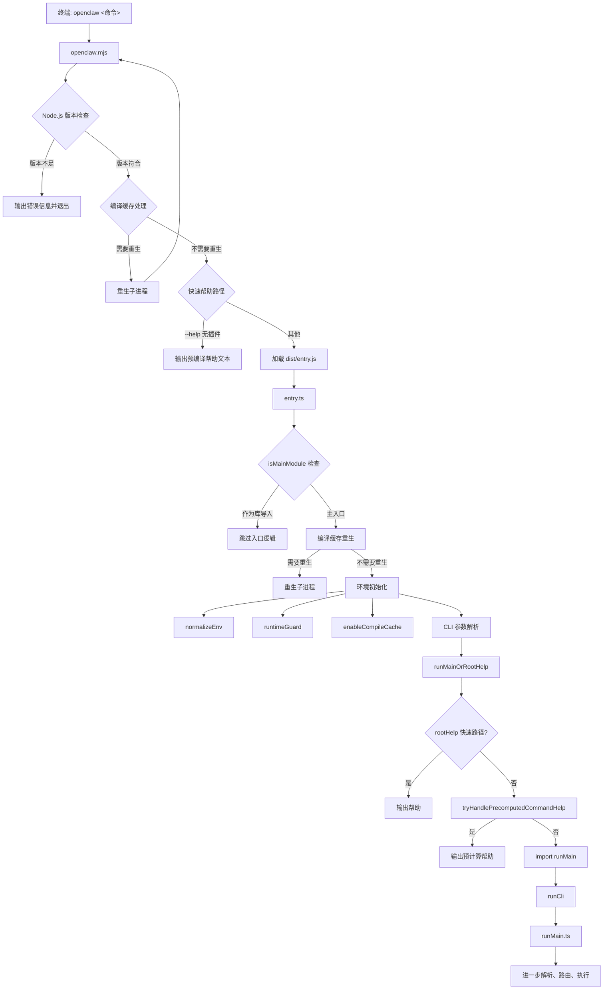
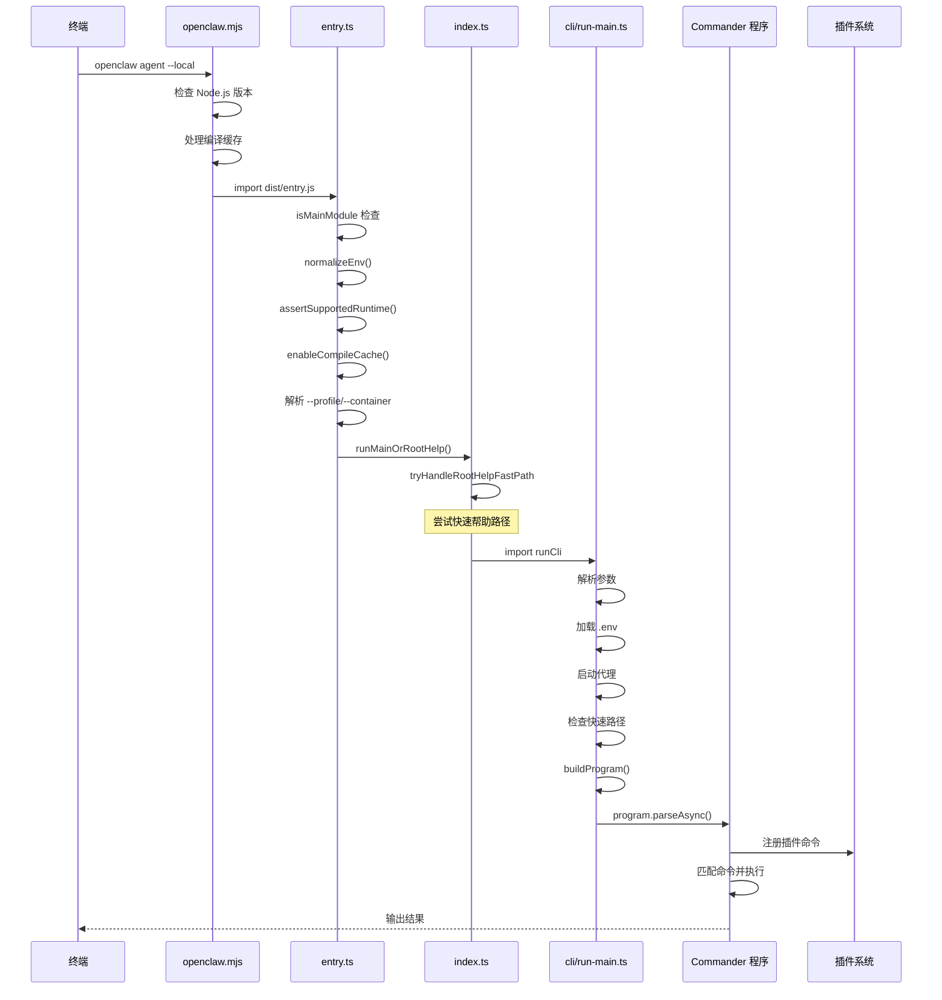
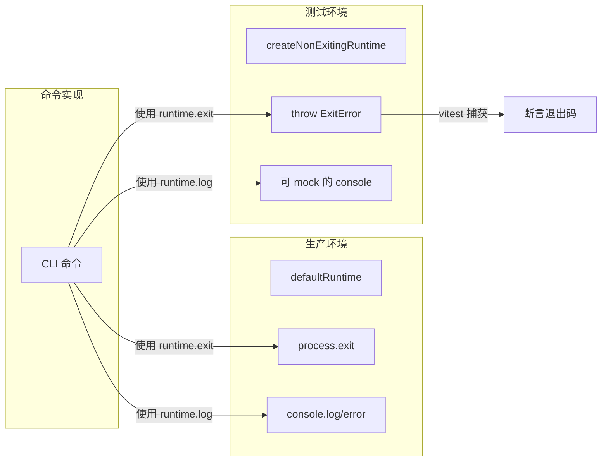
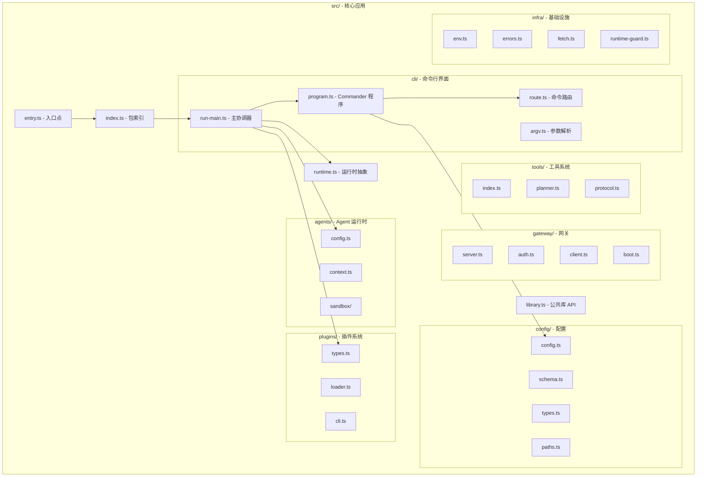
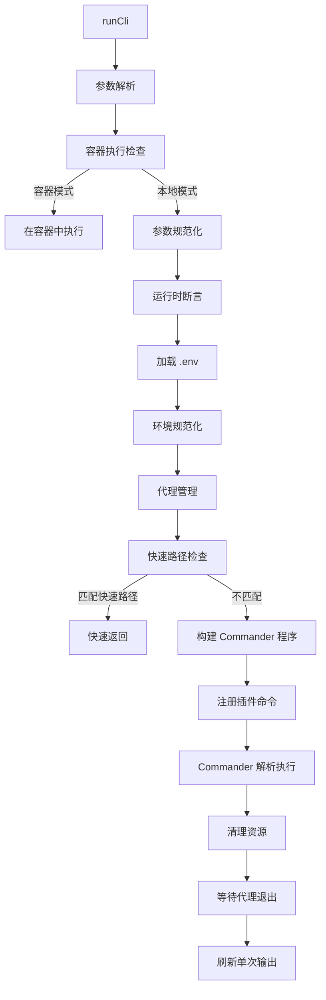

# 第二章：项目骨架与入口点设计

## 2.1 CLI 入口点流程

OpenClaw 的 CLI 入口点设计体现了"分层启动、逐步展开"的理念。当一个用户在终端中输入 `openclaw` 命令时，其背后经历了一个精心设计的启动流程。让我们从最外层开始，逐步深入。

### 整体启动流程



### 第一步：openclaw.mjs - 启动器

`openclaw.mjs`（`/Users/jiayouzhang/code/openclaw/openclaw.mjs`）是 Node.js 可执行文件的入口点，由 `package.json` 中的 `"bin": { "openclaw": "openclaw.mjs" }` 声明。这个文件从一开始就做了几件关键的事情：

**1. 运行时版本检查**

```javascript
// openclaw.mjs - 第 11-15 行
const MIN_NODE_22 = { major: 22, minor: 22, patch: 3 };
const MIN_NODE_24 = { major: 24, minor: 15, patch: 0 };
const MIN_NODE_25 = { major: 25, minor: 9, patch: 0 };
```

OpenClaw 要求 Node.js 版本为 `>=22.22.3 <23`、`>=24.15.0 <25` 或 `>=25.9.0`。对于 Bun 运行时，会直接拒绝（因为 OpenClaw 需要 `node:sqlite` 模块）。

**2. 编译缓存管理**

启动器会检查是否需要通过重生（respawn）子进程来禁用或启用 Node.js 编译缓存。这是因为在某些场景下（如源码开发环境），编译缓存可能导致死锁或其他问题。

```javascript
// openclaw.mjs - 第 226-247 行
const respawnWithoutCompileCacheIfNeeded = () => {
  if (!isSourceCheckoutLauncher()) return false;
  if (process.env[COMPILE_CACHE_DISABLED_RESPAWNED_ENV] === "1") return false;
  // ... 设置 NODE_DISABLE_COMPILE_CACHE 环境变量后重生
};
```

**3. 快速帮助路径**

对于 `openclaw --help` 这样的简单调用，启动器会尝试直接输出预编译的帮助文本，避免加载整个应用。这大大优化了启动时间。

**4. 加载编译后的入口文件**

```javascript
// openclaw.mjs - 第 783-791 行
if (await tryImport("./dist/entry.js")) {
  // OK
} else if (await tryImport("./dist/entry.mjs")) {
  // OK
} else {
  throw new Error(await buildMissingEntryErrorMessage());
}
```

### 第二步：entry.ts - 入口点逻辑

`entry.ts`（`/Users/jiayouzhang/code/openclaw/src/entry.ts`）是编译后从 `openclaw.mjs` 加载的 TypeScript 入口文件。它负责：

1. **检查是否为入口模块**：通过 `isMainModule()` 确保只有作为主入口时才执行启动逻辑，防止被其他模块导入时重复执行
2. **编译缓存重生**：再次检查是否需要通过重生来管理编译缓存
3. **环境初始化**：调用 `normalizeEnv()` 规范化环境变量，调用 `assertSupportedRuntime()` 确认运行时版本
4. **启用编译缓存**：调用 `enableOpenClawCompileCache()` 设置编译缓存目录
5. **CLI 参数解析**：解析 `--profile`、`--container`、`--no-color` 等根级别选项
6. **分发执行**：调用 `runMainOrRootHelp()` 进入主逻辑

```typescript
// entry.ts - 第 56-136 行（简化）
if (!isMainModule(...)) {
  // 作为库导入 - 跳过入口逻辑
} else {
  // 编译缓存处理
  const waitingForCompileCacheRespawn = respawnWithoutOpenClawCompileCacheIfNeeded(...);
  if (!waitingForCompileCacheRespawn) {
    process.title = "openclaw";
    ensureOpenClawExecMarkerOnProcess();
    installProcessWarningFilter();
    normalizeEnv();
    assertSupportedRuntime();
    enableOpenClawCompileCache(...);
    
    // 参数解析
    process.argv = normalizeWindowsArgv(process.argv);
    // 处理 --profile, --container 等
    const parsed = parseCliProfileArgs(parsedContainer.argv);
    if (parsed.profile) applyCliProfileEnv({ profile: parsed.profile });
    
    // 进入主入口
    if (!tryHandleRootVersionFastPath(process.argv)) {
      await runMainOrRootHelp(process.argv);
    }
  }
}
```

### 第三步：index.ts - 包索引与入口转发

`index.ts`（`/Users/jiayouzhang/code/openclaw/src/index.ts`）是 npm 包的入口文件，同时承担两个角色：

- 当作为 CLI 主入口时，转发到 `runLegacyCliEntry()`，最终调用 `cli/run-main.ts` 中的 `runCli()`
- 当作为库被导入时，导出公共 API（如 `loadConfig`、`runExec` 等）

```typescript
// index.ts - 第 59-133 行（简化）
const isMain = isMainModule({ currentFile: fileURLToPath(import.meta.url) });

if (!isMain) {
  // 作为库 - 导出公共 API
  ({ applyTemplate, loadConfig, runExec, ... } = await import("./library.js"));
}

if (isMain) {
  installUnhandledRejectionHandler();
  process.on("uncaughtException", ...);
  void runLegacyCliEntry(process.argv).catch(...);
}
```

### 第四步：run-main.ts - CLI 主协调器

`run-main.ts`（`/Users/jiayouzhang/code/openclaw/src/cli/run-main.ts`）是 CLI 启动的核心协调器，`runCli()` 函数是整个 CLI 的入口。它执行以下任务：

1. **参数规范化**：处理 Windows 参数、容器参数、profile 参数
2. **运行时断言**：确认 Node.js 版本满足要求
3. **环境变量加载**：加载 `.env` 文件
4. **代理管理**：启动调试代理（debug proxy）用于网络请求捕获
5. **快速路径**：尝试多种快速路径（root help、browser help、secrets help、nodes help、子命令帮助等）
6. **插件命令注册**：从注册表加载插件 CLI 命令
7. **Commander 解析**：构建 Commander 程序并执行参数解析

```typescript
// run-main.ts - runCli 函数（第 841 行）
export async function runCli(argv: string[] = process.argv) {
  // 1. 参数解析
  const parsedContainer = parseCliContainerArgs(originalArgv);
  const parsedProfile = parseCliProfileArgs(parsedContainer.argv);
  
  // 2. 容器执行
  const containerTarget = maybeRunCliInContainer(originalArgv);
  if (containerTarget.handled) { ... return; }
  
  // 3. 环境初始化
  assertSupportedRuntime();
  loadCliDotEnv();
  normalizeEnv();
  
  // 4. 代理管理
  if (shouldStartProxyForCli(normalizedArgv)) {
    await replaceStartedProxy(config?.proxy);
  }
  
  // 5. 快速路径检查
  if (shouldUseRootHelpFastPath(normalizedArgv)) { ... return; }
  if (shouldUseBrowserHelpFastPath(normalizedArgv)) { ... return; }
  // ... 更多快速路径
  
  // 6. 构建 Commander 程序并解析
  const { buildProgram } = await import("./program.js");
  const program = await buildProgram();
  await program.parseAsync(parseArgv);
}
```

### 启动流程的 Mermaid 序列图



## 2.2 运行时模块

`runtime.ts`（`/Users/jiayouzhang/code/openclaw/src/runtime.ts`）是 OpenClaw 中一个被低估但至关重要的模块。它提供了 CLI 命令和测试之间的抽象层，使得同一个命令逻辑可以在不同环境下运行。

### RuntimeEnv 类型

```typescript
// runtime.ts - 第 5-9 行
export type RuntimeEnv = {
  log: (...args: unknown[]) => void;      // 日志输出
  error: (...args: unknown[]) => void;    // 错误输出
  exit: (code: number) => void;           // 进程退出
};
```

### OutputRuntimeEnv 类型

```typescript
// runtime.ts - 第 11-14 行
export type OutputRuntimeEnv = RuntimeEnv & {
  writeStdout: (value: string) => void;   // 直接写入 stdout
  writeJson: (value: unknown, space?: number) => void;  // 输出 JSON
};
```

`OutputRuntimeEnv` 在 `RuntimeEnv` 的基础上增加了结构化输出能力，适用于需要 JSON 输出模式的命令。

### defaultRuntime

`defaultRuntime` 是生产环境的默认运行时实现，直接使用 `console.log`、`console.error` 和 `process.exit`：

```typescript
// runtime.ts - 第 89-96 行
export const defaultRuntime: OutputRuntimeEnv = {
  ...createRuntimeIo(),
  exit: (code) => {
    restoreTerminalState("runtime exit", { resumeStdinIfPaused: false });
    process.exit(code);
    throw new Error("unreachable");
  },
};
```

### ExitError

`ExitError` 是一个特殊的错误类，用于在非退出模式下模拟进程退出：

```typescript
// runtime.ts - 第 99-107 行
export class ExitError extends Error {
  constructor(
    public readonly code: number,
    message?: string,
  ) {
    super(message ?? `exit ${code}`);
    this.name = "ExitError";
  }
}
```

### createNonExitingRuntime

`createNonExitingRuntime()` 创建一个"不真正退出"的运行时，当调用 `exit()` 时不会结束进程，而是抛出 `ExitError`。这在测试场景中至关重要：

```typescript
// runtime.ts - 第 109-116 行
export function createNonExitingRuntime(): OutputRuntimeEnv {
  return {
    ...createRuntimeIo(),
    exit: (code: number) => {
      throw new ExitError(code);
    },
  };
}
```

### 运行时抽象的价值



这种设计模式的价值在于：

1. **可测试性**：测试代码可以安全地调用 `runtime.exit(1)`，不会真正终止测试进程
2. **一致性**：CLI 命令的实现不关心它是在生产环境还是测试环境中运行
3. **可扩展性**：未来可以添加更多运行时实现（如远程执行、WebSocket 等）

## 2.3 模块结构

### 核心应用模块 (src/)



### 内部包 (packages/)

| 包名 | 路径 | 说明 |
|------|------|------|
| `@openclaw/agent-core` | `packages/agent-core/` | Agent 核心抽象：Agent 循环、session、harness、消息类型 |
| `@openclaw/llm-core` | `packages/llm-core/` | LLM 核心类型：模型契约、消息格式、验证逻辑 |
| `@openclaw/ai` | `packages/ai/` | AI 提供商实现：OpenAI、Anthropic、Google 等主流模型 |
| `@openclaw/plugin-sdk` | `packages/plugin-sdk/` | 插件 SDK：渠道、提供商、工具等运行时抽象 |
| `@openclaw/gateway-protocol` | `packages/gateway-protocol/` | 网关协议：帧结构、schema、错误码 |
| `@openclaw/gateway-client` | `packages/gateway-client/` | 网关客户端：连接管理、认证、心跳 |
| `@openclaw/acp-core` | `packages/acp-core/` | Agent 通信协议 |
| `@openclaw/sdk` | `packages/sdk/` | 公共 SDK |
| `@openclaw/model-catalog-core` | `packages/model-catalog-core/` | 模型目录核心类型 |
| `@openclaw/normalization-core` | `packages/normalization-core/` | 数据规范化工具 |
| `@openclaw/net-policy` | `packages/net-policy/` | 网络策略：IP 验证、URL 安全 |
| `@openclaw/media-core` | `packages/media-core/` | 媒体处理核心 |
| `@openclaw/markdown-core` | `packages/markdown-core/` | Markdown 处理 |
| `@openclaw/memory-host-sdk` | `packages/memory-host-sdk/` | 记忆系统 SDK |
| `@openclaw/terminal-core` | `packages/terminal-core/` | 终端核心 |
| `@openclaw/web-content-core` | `packages/web-content-core/` | Web 内容处理 |
| `@openclaw/speech-core` | `packages/speech-core/` | 语音处理 |
| `@openclaw/tool-call-repair` | `packages/tool-call-repair/` | 工具调用修复 |
| `@openclaw/plugin-package-contract` | `packages/plugin-package-contract/` | 插件包合约 |

### 扩展插件 (extensions/)

扩展目录包含 100+ 个独立包，分为两大类：

**渠道插件**：实现消息渠道的接入

| 扩展 | 包名 |
|------|------|
| Slack | `extensions/slack/` |
| Discord | `extensions/discord/` |
| Telegram | `extensions/telegram/` |
| 飞书 | `extensions/feishu/` |
| WhatsApp | `extensions/whatsapp/` |
| Signal | `extensions/signal/` |
| QQ 机器人 | `extensions/qqbot/` |
| 微信 | `extensions/xiaomi/` |
| ... | ... |

**提供商插件**：实现 LLM 提供商的接入

| 扩展 | 包名 |
|------|------|
| OpenAI | `extensions/openai/` |
| Anthropic | `extensions/anthropic/` |
| Google | `extensions/google/` |
| DeepSeek | `extensions/deepseek/` |
| Groq | `extensions/groq/` |
| Ollama | `extensions/ollama/` |
| Mistral | `extensions/mistral/` |
| ... | ... |

### pnpm 工作区配置

`pnpm-workspace.yaml` 定义了工作区的包范围：

```yaml
packages:
  - .
  - ui
  - packages/*
  - extensions/*
  - examples/*
```

这意味着所有在 `packages/`、`extensions/`、`examples/` 下的子目录以及根目录和 `ui/` 都会被识别为工作区包。

## 2.4 入口点源码分析

### openclaw.mjs 关键代码分析

`openclaw.mjs` 是用户直接执行的入口，它位于项目根目录，由 `package.json` 的 `bin` 字段声明。

**版本检查逻辑**：

```javascript
const ensureSupportedRuntimeVersion = () => {
  if (process.versions.bun) {
    // Bun 不支持 - 因为需要 node:sqlite
    process.exit(1);
  }
  if (isSupportedNodeVersion(parseNodeVersion(process.versions.node))) {
    return;
  }
  // 输出版本错误信息并退出
  process.exit(1);
};
```

**编译缓存重生策略**：

启动器实现了两级重生策略：

1. **源码开发环境**：如果检测到 `.git` 目录或 `src/entry.ts`，说明是源码开发环境，此时禁用编译缓存重生
2. **打包安装环境**：如果是从 npm 安装的包，则设置 `NODE_COMPILE_CACHE` 环境变量指向一个特定版本的缓存目录

```javascript
const waitingForCompileCacheRespawn =
  respawnWithoutCompileCacheIfNeeded() || respawnWithPackagedCompileCacheIfNeeded();
```

**快速帮助路径**：

对于 `openclaw --help` 这样的简单调用，启动器会尝试从预先构建的 `dist/cli-startup-metadata.json` 中读取帮助文本，避免加载整个应用。

### entry.ts 关键代码分析

`entry.ts` 中的 `isMainModule` 检查是一个重要的安全守卫：

```typescript
if (
  !isMainModule({
    currentFile: fileURLToPath(import.meta.url),
    wrapperEntryPairs: [...ENTRY_WRAPPER_PAIRS],
  })
) {
  // 作为依赖导入 - 跳过所有入口副作用
} else {
  // 主入口 - 执行启动逻辑
}
```

这是因为 `entry.ts` 可能被多个入口文件导入（如 `openclaw.mjs` 和 `dist/index.js`），`isMainModule` 确保只有真正的主入口文件才会执行启动逻辑，防止重复启动。

### run-main.ts 中的 runCli 函数

`runCli()` 函数是 CLI 启动的核心，它的执行流程非常清晰：



### runtime.ts 关键代码分析

`createRuntimeIo()` 是创建运行时 I/O 的工厂函数，它封装了 `console.log` 和 `console.error` 的行为，并添加了 `writeStdout` 和 `writeJson` 方法：

```typescript
function createRuntimeIo(): Pick<OutputRuntimeEnv, "log" | "error" | "writeStdout" | "writeJson"> {
  return {
    log: (...args) => {
      if (!shouldEmitRuntimeLog()) return;  // 测试环境下可静音
      clearActiveProgressLine();
      console.log(...args);
    },
    error: (...args) => {
      clearActiveProgressLine();
      console.error(...args);
    },
    writeStdout: (value) => {
      clearActiveProgressLine();
      process.stdout.write(value.endsWith("\n") ? value : `${value}\n`);
    },
    writeJson: (value, space = 2) => {
      writeStdout(JSON.stringify(value, null, space > 0 ? space : undefined));
    },
  };
}
```

`shouldEmitRuntimeLog()` 函数在测试环境下（`VITEST=true`）会抑制日志输出，除非显式设置 `OPENCLAW_TEST_RUNTIME_LOG=1` 或 `console.log` 被 mock 了：

```typescript
function shouldEmitRuntimeLog(env: NodeJS.ProcessEnv = process.env): boolean {
  if (env.VITEST !== "true") return true;
  if (env.OPENCLAW_TEST_RUNTIME_LOG === "1") return true;
  const maybeMockedLog = console.log as unknown as { mock?: unknown };
  return typeof maybeMockedLog.mock === "object";
}
```

## 2.5 关键设计理念

### 分层启动

OpenClaw 的启动流程被精心分层，每一层都有明确的职责：

1. **启动器层（openclaw.mjs）**：运行时版本检查、编译缓存管理、快速路径优化
2. **入口层（entry.ts）**：环境初始化、参数解析、分发到主逻辑
3. **协调层（run-main.ts）**：插件加载、命令注册、Commander 执行

这种分层设计使得每一层都可以独立测试和优化。

### 快速路径优化

为了优化 CLI 的启动时间，OpenClaw 实现了多层快速路径：

1. **启动器级别的快速帮助**：对于 `--help` 和 `--version`，直接从预编译的元数据文件中读取
2. **入口级别的快速帮助**：对于特定命令的帮助（如 `openclaw browser --help`），也使用预编译文本
3. **运行时级别的快速路径**：对于 `gateway run` 等命令，使用轻量级路径绕过完整的程序构建

### 环境抽象

`RuntimeEnv` 抽象层使得 CLI 命令可以在不同环境下运行：

- **生产环境**：`defaultRuntime` - 真实进程行为
- **测试环境**：`createNonExitingRuntime()` - 安全的测试行为
- **未来扩展**：可以创建更多的运行时实现（如远程调试、WebSocket 终端等）

### 重生策略

启动过程中的"重生"（respawn）机制是 OpenClaw 的一个独特设计。当需要调整 Node.js 运行时参数时（如编译缓存设置），当前进程会创建一个子进程来执行实际逻辑，而父进程仅作为信号转发器。这种设计确保了：

- 运行时参数在进程启动后不可变，重生是调整它们的唯一方式
- 父进程可以安全地转发信号（SIGTERM、SIGINT 等）到子进程
- 子进程崩溃不会影响父进程的信号处理

## 2.6 小结

本章深入分析了 OpenClaw 的项目骨架和入口点设计。从 `openclaw.mjs` 启动器到 `entry.ts` 入口点，再到 `run-main.ts` 的 CLI 协调器，我们看到了一个精心设计的分层启动架构。

关键要点：

- **启动流程**：从 `openclaw.mjs` → `entry.ts` → `index.ts` → `run-main.ts`，每一层都有明确的职责
- **运行时抽象**：`RuntimeEnv` 和 `OutputRuntimeEnv` 类型、`defaultRuntime`、`ExitError`、`createNonExitingRuntime()` 共同构成了一个灵活的环境抽象层
- **模块结构**：`src/` 包含核心应用逻辑，`packages/` 提供内部共享库，`extensions/` 放置渠道和提供商插件
- **快速路径**：多层快速路径优化显著提升了 CLI 的启动速度
- **重生策略**：通过进程重生来管理 Node.js 运行时参数

在下一章中，我们将深入分析 Agent Core 包，了解 Agent 运行时的核心抽象和实现。