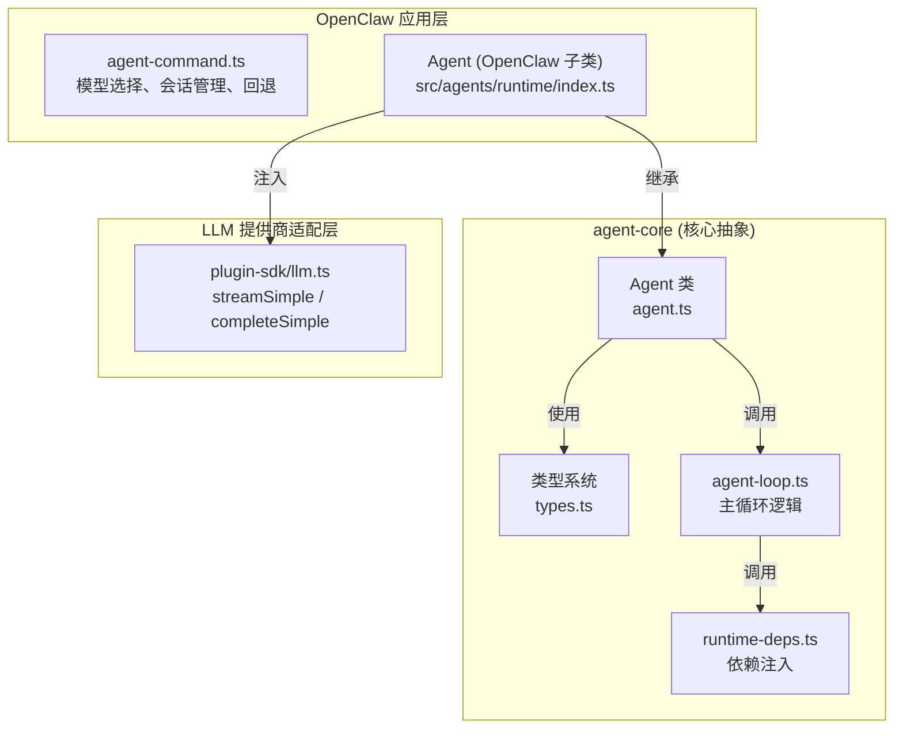
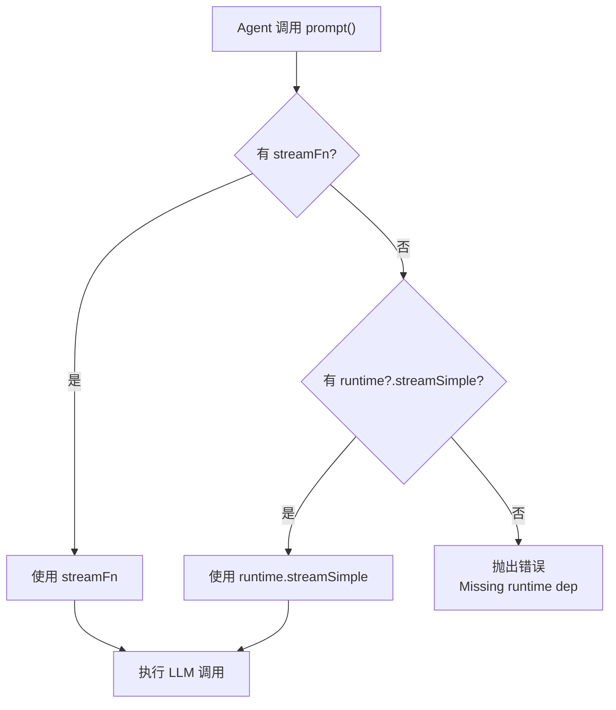

# 第三章：Agent 核心抽象

本章讲解 OpenClaw 中 Agent 核心层的抽象设计。`agent-core` 是一个**与具体 LLM 提供商无关**的包，它定义了 Agent 的通用接口、消息类型系统、运行时依赖注入机制，以及一个可扩展的 `Agent` 类封装。

## 3.1 整体架构



`agent-core` 位于中间层，不直接依赖任何 LLM 提供商 SDK。它通过**依赖注入**（dependency injection）接收 `streamSimple` 和 `completeSimple` 函数，从而实现完全的提供商无关性。

## 3.2 AgentOptions 接口

`Agent` 类的构造函数接收 `AgentOptions` 对象，这是整个 Agent 的配置入口：

```typescript
// packages/agent-core/src/agent.ts
export interface AgentOptions {
  /** 初始状态：消息、工具、系统提示词、模型、思考级别 */
  initialState?: Partial<
    Omit<AgentState, "pendingToolCalls" | "isStreaming" | "streamingMessage" | "errorMessage">
  >;

  /** 将 Agent 内部消息转换为 LLM 可理解的消息格式 */
  convertToLlm?: (messages: AgentMessage[]) => Message[] | Promise<Message[]>;

  /** 在每次 LLM 调用前对上下文进行变换（如裁剪窗口） */
  transformContext?: (messages: AgentMessage[], signal?: AbortSignal) => Promise<AgentMessage[]>;

  /** 注入的流式运行时，用于 streamFn 未提供时的后备 */
  runtime?: AgentCoreStreamRuntimeDeps;

  /** 显式的流式实现，优先级高于 runtime.streamSimple */
  streamFn?: StreamFn;

  /** 动态解析 API key（对短生命期 OAuth 令牌有用） */
  getApiKey?: (provider: string) => Promise<string | undefined> | string | undefined;

  /** 在 LLM 请求发送前检查 payload */
  onPayload?: SimpleStreamOptions["onPayload"];

  /** 在 LLM 响应返回后检查响应 */
  onResponse?: SimpleStreamOptions["onResponse"];

  /** 工具执行前的钩子，可阻断工具调用 */
  beforeToolCall?: (
    context: BeforeToolCallContext,
    signal?: AbortSignal,
  ) => Promise<BeforeToolCallResult | undefined>;

  /** 解析延迟授权的工具 */
  resolveDeferredTool?: AgentLoopConfig["resolveDeferredTool"];

  /** 工具执行后的钩子，可修改工具结果 */
  afterToolCall?: (
    context: AfterToolCallContext,
    signal?: AbortSignal,
  ) => Promise<AfterToolCallResult | undefined>;

  /** 轮次之间的准备钩子，可更新模型、推理级别或上下文 */
  prepareNextTurn?: (
    signal?: AbortSignal,
  ) => Promise<AgentLoopTurnUpdate | undefined> | AgentLoopTurnUpdate | undefined;

  /** 引导消息的队列消费模式 */
  steeringMode?: QueueMode;

  /** 后续消息的队列消费模式 */
  followUpMode?: QueueMode;

  /** 会话标识符，转发给支持缓存的提供商 */
  sessionId?: string;

  /** 各思考级别的 token 预算 */
  thinkingBudgets?: ThinkingBudgets;

  /** 首选的提供商传输协议 */
  transport?: Transport;

  /** 提供商重试延迟的最大值（毫秒） */
  maxRetryDelayMs?: number;

  /** 单条 assistant 消息中多个工具调用的默认执行策略 */
  toolExecution?: ToolExecutionMode;
}
```

### 关键设计决策

- **`convertToLlm`**：Agent 可以包含自定义消息类型（如 `bashExecution`、`custom`），这些消息类型在发送给 LLM 之前需要被过滤或转换。默认实现只保留 `user`、`assistant` 和 `toolResult` 三种角色。
- **`runtime` vs `streamFn`**：`streamFn` 优先于 `runtime.streamSimple`，这种设计使得调用方可以在不改变运行时注入的情况下临时覆盖流式实现。
- **`beforeToolCall` / `afterToolCall`**：这些钩子接收 `AbortSignal`，必须尊重该信号的中止请求。

## 3.3 AgentState 类型

`AgentState` 定义了 Agent 的**公开可观察状态**，通过访问器属性实现：

```typescript
// packages/agent-core/src/types.ts
export interface AgentState {
  /** 每次模型请求附带系统提示词 */
  systemPrompt: string;

  /** 当前使用的模型 */
  model: Model;

  /** 请求的推理级别 */
  thinkingLevel: ThinkingLevel;

  /** 可用工具（赋值时浅拷贝数组） */
  set tools(tools: AgentTool[]);
  get tools(): AgentTool[];

  /** 对话记录（赋值时浅拷贝数组） */
  set messages(messages: AgentMessage[]);
  get messages(): AgentMessage[];

  /** Agent 是否正在处理 prompt 或 continuation */
  readonly isStreaming: boolean;

  /** 当前流式响应的部分 assistant 消息 */
  readonly streamingMessage?: AgentMessage;

  /** 正在执行的工具调用 ID 集合 */
  readonly pendingToolCalls: ReadonlySet<string>;

  /** 最近一轮失败或中止的错误消息 */
  readonly errorMessage?: string;
}
```

`AgentState` 的设计要点：
- `tools` 和 `messages` 使用 setter/getter，赋值时自动浅拷贝，防止外部引用篡改内部状态。
- `isStreaming`、`streamingMessage`、`pendingToolCalls` 和 `errorMessage` 是只读的，由 `Agent` 内部通过事件驱动更新。
- 内部实现使用 `MutableAgentState` 类型（包含可写版本），确保类型安全。

## 3.4 Agent 类

`Agent` 类是 `agent-core` 的核心封装，它管理状态、事件、队列和生命周期：

```typescript
// packages/agent-core/src/agent.ts
export class Agent {
  private mutableState: MutableAgentState;
  private readonly listeners = new Set<
    (event: AgentEvent, signal: AbortSignal) => Promise<void> | void
  >();
  private readonly steeringQueue: PendingMessageQueue;
  private readonly followUpQueue: PendingMessageQueue;
  private activeRun?: ActiveRun;

  // ... 构造函数、订阅、状态访问、队列操作、prompt/continue 方法
}
```

### 3.4.1 消息队列机制

`Agent` 内部使用两个 `PendingMessageQueue` 实例：

```mermaid
graph LR
    subgraph "外部输入"
        User["用户消息"]
        System["系统指令"]
    end

    subgraph "Agent 内部队列"
        SQ["Steering Queue<br/>引导消息队列"]
        FQ["Follow-Up Queue<br/>后续消息队列"]
    end

    subgraph "消费模式"
        OA["one-at-a-time<br/>每次只消费最早的一条"]
        ALL["all<br/>一次性消费全部"]
    end

    User -->|steer()| SQ
    System -->|followUp()| FQ
    SQ -->|drain| OA
    SQ -->|drain| ALL
    FQ -->|drain| OA
    FQ -->|drain| ALL
```

- **Steering Messages**：通过 `steer()` 方法入队，在当前 assistant 轮次结束后注入，用于「引导」正在工作的 Agent。
- **Follow-Up Messages**：通过 `followUp()` 方法入队，仅在 Agent 即将停止时才注入，用于「补充」后续处理。
- **`QueueMode`**：`"one-at-a-time"`（默认）每次只消费最早的一条消息，剩余的保留到下一次消费点；`"all"` 一次性消费全部。

### 3.4.2 生命周期方法

```typescript
// 订阅事件
subscribe(listener: (event: AgentEvent, signal: AbortSignal) => void): () => void;

// 启动新 prompt（支持文本、单条消息或消息数组）
prompt(message: AgentMessage | AgentMessage[]): Promise<void>;
prompt(input: string, images?: ImageContent[]): Promise<void>;

// 从当前对话记录继续（最后一条消息必须是 user 或 toolResult）
continue(): Promise<void>;

// 中止当前运行
abort(): void;

// 等待当前运行完成（包括 agent_end 事件监听器）
waitForIdle(): Promise<void>;

// 重置所有状态
reset(): void;
```

### 3.4.3 事件处理流程

`Agent` 内部通过 `processEvents()` 方法将 `AgentEvent` 映射到状态变更：

```typescript
private async processEvents(event: AgentEvent): Promise<void> {
  switch (event.type) {
    case "agent_start":
    case "turn_start":
      break; // 无状态变更

    case "message_start":
      this.mutableState.streamingMessage = event.message;
      break;

    case "message_update":
      this.mutableState.streamingMessage = event.message;
      break;

    case "message_end":
      this.mutableState.streamingMessage = undefined;
      this.mutableState.messages.push(event.message); // 追加到对话记录
      break;

    case "tool_execution_start":
      this.mutableState.pendingToolCalls = new Set([...this.mutableState.pendingToolCalls, event.toolCallId]);
      break;

    case "tool_execution_end":
      // 删除工具 ID
      break;

    case "turn_end":
      // 记录错误消息
      break;

    case "agent_end":
      this.mutableState.streamingMessage = undefined;
      break;
  }

  // 通知所有订阅者
  for (const listener of this.listeners) {
    await listener(event, signal);
  }
}
```

## 3.5 消息类型系统

`agent-core` 定义了一套扩展的消息类型系统，位于 `types.ts`：

### 3.5.1 AgentMessage

`AgentMessage` 是 `Message`（标准的 LLM 消息）与**自定义消息类型**的联合：

```typescript
// packages/agent-core/src/types.ts
export type AgentMessage = Message | CustomAgentMessages[keyof CustomAgentMessages];

export interface CustomAgentMessages {
  bashExecution: BashExecutionMessage;   // shell 命令执行记录
  custom: CustomMessage;                  // 应用自定义消息
  branchSummary: BranchSummaryMessage;    // 分支摘要
  compactionSummary: CompactionSummaryMessage; // 上下文压缩摘要
}
```

这种设计允许应用层定义自己的消息类型（如 `bashExecution`），同时保持与核心 LLM 消息的兼容性。`convertToLlm` 回调负责将这些自定义类型转换为 LLM 可理解的消息格式。

### 3.5.2 AgentTool

`AgentTool` 扩展了 `Tool` 类型，增加了 `execute` 方法和进度回调：

```typescript
export interface AgentTool<
  TParameters extends TSchema = TSchema,
  TDetails = unknown,
> extends Tool<TParameters> {
  /** 人类可读的 UI 标签 */
  label: string;
  /** 是否隐藏通道进度 */
  hideFromChannelProgress?: boolean;
  /** 参数兼容性 shim */
  prepareArguments?: (args: unknown) => Static<TParameters>;
  /** 执行工具调用 */
  execute: (
    toolCallId: string,
    params: Static<TParameters>,
    signal?: AbortSignal,
    onUpdate?: AgentToolUpdateCallback<TDetails>,
  ) => Promise<AgentToolResult<TDetails>>;
  /** 单个工具的执行模式覆盖 */
  executionMode?: ToolExecutionMode;
}
```

### 3.5.3 AgentEvent 事件类型

Agent 事件流使用**可辨识联合类型**（discriminated union）：

```typescript
export type AgentEvent =
  // Agent 生命周期
  | { type: "agent_start" }
  | { type: "agent_end"; messages: AgentMessage[] }
  // 轮次生命周期（一轮 = 一次 assistant 响应 + 工具调用）
  | { type: "turn_start" }
  | { type: "turn_end"; message: AgentMessage; toolResults: ToolResultMessage[] }
  // 消息生命周期
  | { type: "message_start"; message: AgentMessage }
  | { type: "message_update"; message: AgentMessage; assistantMessageEvent: AssistantMessageEvent }
  | { type: "message_end"; message: AgentMessage }
  // 工具执行生命周期
  | { type: "tool_execution_start"; toolCallId: string; toolName: string; args: unknown }
  | { type: "tool_execution_update"; toolCallId: string; partialResult: unknown }
  | { type: "tool_execution_end"; toolCallId: string; result: unknown; isError: boolean };
```

### 3.5.4 AgentLoopConfig

`AgentLoopConfig` 是低层循环的所有配置项——它比 `AgentOptions` 更底层，直接传递给 `agent-loop.ts`：

```typescript
export interface AgentLoopConfig extends SimpleStreamOptions {
  model: Model;
  thinkingLevel?: ThinkingLevel;
  convertToLlm: (messages: AgentMessage[]) => Message[] | Promise<Message[]>;
  transformContext?: (messages: AgentMessage[], signal?: AbortSignal) => Promise<AgentMessage[]>;
  getApiKey?: (provider: string) => Promise<string | undefined> | string | undefined;
  shouldStopAfterTurn?: (context: ShouldStopAfterTurnContext) => boolean | Promise<boolean>;
  prepareNextTurn?: (context: PrepareNextTurnContext) => AgentLoopTurnUpdate | undefined | Promise<...>;
  getSteeringMessages?: () => Promise<AgentMessage[]>;
  getFollowUpMessages?: () => Promise<AgentMessage[]>;
  toolExecution?: ToolExecutionMode;
  beforeToolCall?: (context: BeforeToolCallContext, signal?: AbortSignal) => Promise<...>;
  resolveDeferredTool?: (context: DeferredToolCallContext, signal?: AbortSignal) => Promise<...>;
  afterToolCall?: (context: AfterToolCallContext, signal?: AbortSignal) => Promise<...>;
}
```

### 3.5.5 钩子上下文类型

```typescript
export interface BeforeToolCallContext {
  assistantMessage: AssistantMessage;
  toolCall: AgentToolCall;
  args: unknown;           // 已验证的参数
  context: AgentContext;
}

export interface AfterToolCallContext {
  assistantMessage: AssistantMessage;
  toolCall: AgentToolCall;
  args: unknown;
  result: AgentToolResult<unknown>;
  isError: boolean;
  context: AgentContext;
}

export interface DeferredToolCallContext {
  assistantMessage: AssistantMessage;
  toolCall: AgentToolCall;
  context: AgentContext;
}
```

## 3.6 运行时依赖注入

`runtime-deps.ts` 定义了 agent-core 与 LLM 提供商之间的边界：

```typescript
// packages/agent-core/src/runtime-deps.ts
export interface AgentCoreRuntimeDeps {
  /** 流式补全实现，用于普通 Agent 轮次 */
  streamSimple: StreamFn;
  /** 非流式补全实现，用于摘要等辅助功能 */
  completeSimple: CompleteSimpleFn;
}

export type AgentCoreStreamRuntimeDeps = Pick<AgentCoreRuntimeDeps, "streamSimple">;
export type AgentCoreCompletionRuntimeDeps = Pick<AgentCoreRuntimeDeps, "completeSimple">;
```

### 依赖解析逻辑

```typescript
function resolveAgentCoreStreamFn(
  runtime: AgentCoreStreamRuntimeDeps | undefined,
  streamFn?: StreamFn,
): StreamFn {
  if (streamFn) {
    return streamFn;          // 1. 显式 streamFn 优先
  }
  if (runtime?.streamSimple) {
    return runtime.streamSimple;  // 2. 运行时注入次之
  }
  throw missingRuntimeDep("streamSimple"); // 3. 两者都没有则报错
}
```



## 3.7 OpenClaw 的 Agent 实现

OpenClaw 在 `src/agents/runtime/index.ts` 中提供了具体的 `Agent` 子类，将 `agent-core` 与插件 SDK 的 LLM 运行时连接起来：

```typescript
// src/agents/runtime/index.ts
import { Agent as CoreAgent, type AgentOptions as CoreAgentOptions } from "../../../packages/agent-core/src/agent.js";
import { type AgentCoreRuntimeDeps } from "../../../packages/agent-core/src/runtime-deps.js";
import { completeSimple, streamSimple } from "../../plugin-sdk/llm.js";

export const openClawAgentCoreRuntime = {
  completeSimple: completeSimple as unknown as CompleteSimpleFn,
  streamSimple: streamSimple as unknown as StreamFn,
} satisfies AgentCoreRuntimeDeps;

export class Agent extends CoreAgent {
  constructor(options: CoreAgentOptions = {}) {
    super({ runtime: openClawAgentCoreRuntime, ...options });
  }
}
```

这个实现的关键点：
1. **`openClawAgentCoreRuntime`**：一个单例对象，将插件 SDK 的 `streamSimple` 和 `completeSimple` 包装为 `AgentCoreRuntimeDeps`。
2. **`Agent` 子类**：继承 `CoreAgent`，在构造函数中自动注入 `openClawAgentCoreRuntime`，使得调用方不需要手动传递运行时依赖。
3. **类型转换**：由于插件 SDK 和 `agent-core` 可能使用不同的类型定义，使用了 `as unknown as` 进行类型断言。

## 3.8 工具类型系统

OpenClaw 在 `src/agents/tools/common.ts` 中定义了工具相关的类型和工具函数：

### 3.8.1 工具类型

```typescript
// src/agents/tools/common.ts
/** 带元数据的 Agent 工具 */
export type AgentToolWithMeta<TParameters extends TSchema, TResult> = AgentTool<
  TParameters,
  TResult
> & {
  displaySummary?: string;
  prepareBeforeToolCallParams?: (params: unknown, ctx: { ... }) => unknown;
  finalizeBeforeToolCallParams?: (params: unknown, preparedParams: unknown) => unknown;
};

/** 擦除类型的工具（用于运行时无需关心具体参数/结果类型） */
export type AnyAgentTool = Omit<AgentTool, "execute"> & ErasedAgentToolExecute & {
  displaySummary?: string;
  prepareBeforeToolCallParams?: ...;
  finalizeBeforeToolCallParams?: ...;
};
```

### 3.8.2 错误类型

```typescript
export class ToolInputError extends Error {
  readonly status: number = 400;
  constructor(message: string) {
    super(message);
    this.name = "ToolInputError";
  }
}

export class ToolAuthorizationError extends ToolInputError {
  override readonly status = 403;
  constructor(message: string) {
    super(message);
    this.name = "ToolAuthorizationError";
  }
}
```

### 3.8.3 工具结果辅助函数

```typescript
// src/agents/tools/tool-results.ts
export function textResult<TDetails>(text: string, details: TDetails): AgentToolResult<TDetails> {
  return {
    content: [{ type: "text", text }],
    details,
  };
}

export function jsonResult<TDetails>(payload: TDetails): AgentToolResult<TDetails> {
  return textResult(JSON.stringify(payload, null, 2), payload);
}
```

### 3.8.4 参数读取辅助函数

```typescript
/** 将工具参数安全地转换为 Record<string, unknown> */
export function asToolParamsRecord(params: unknown): Record<string, unknown> {
  return params && typeof params === "object" && !Array.isArray(params)
    ? (params as Record<string, unknown>)
    : {};
}
```

## 3.9 总结

本章介绍的 Agent 核心抽象体现了以下设计原则：

| 原则 | 体现 |
|------|------|
| **依赖反转** | `agent-core` 不依赖具体 LLM 提供商，通过 `AgentCoreRuntimeDeps` 接口注入运行时 |
| **开闭原则** | 通过 `AgentOptions` 的钩子（`beforeToolCall`、`afterToolCall` 等）扩展行为，无需修改核心代码 |
| **单一职责** | `Agent` 类负责状态管理和生命周期，`agent-loop.ts` 负责循环逻辑，`types.ts` 负责类型定义 |
| **可观察性** | 通过 `AgentEvent` 事件流和 `subscribe` 机制，UI 层可以实时获取 Agent 内部状态 |

下一章将深入讲解 Agent 核心循环的实现细节。