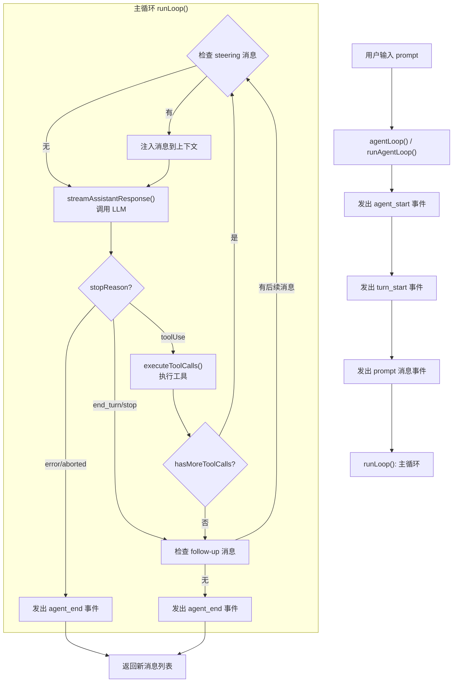
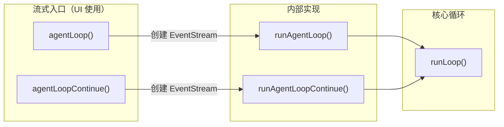
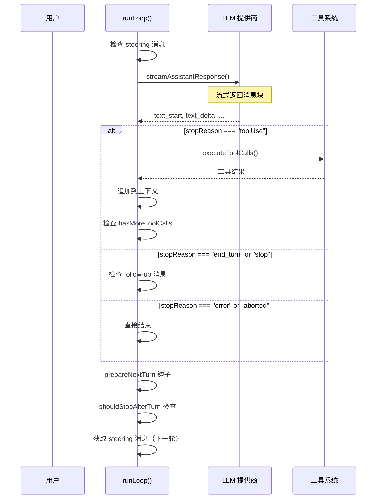
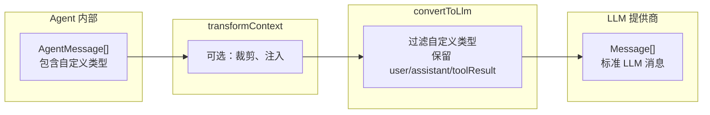
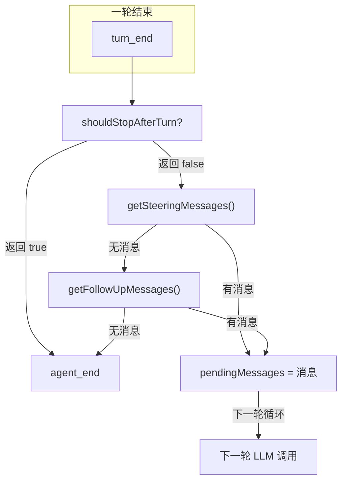
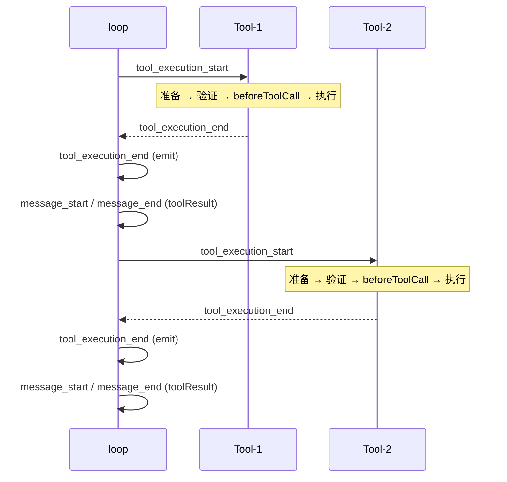
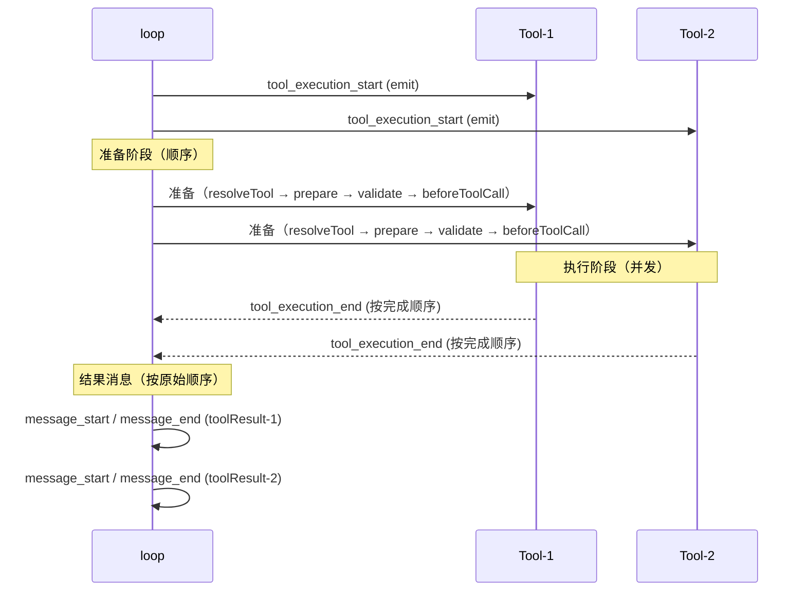
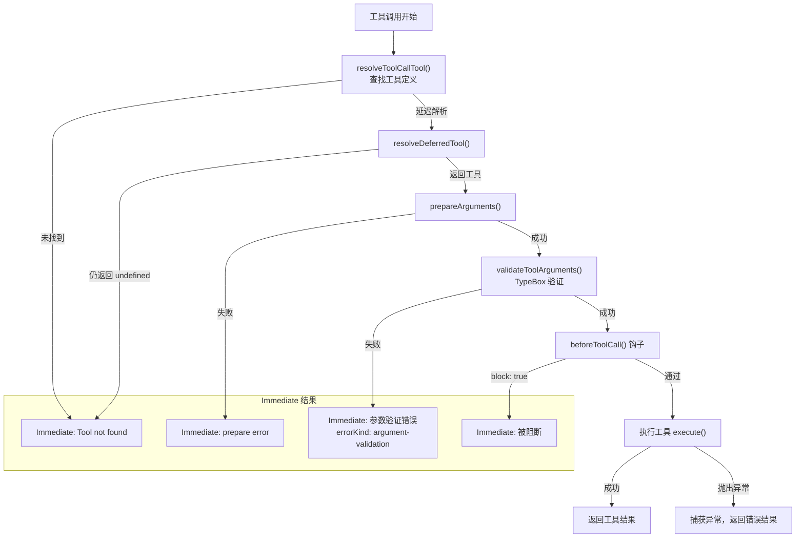
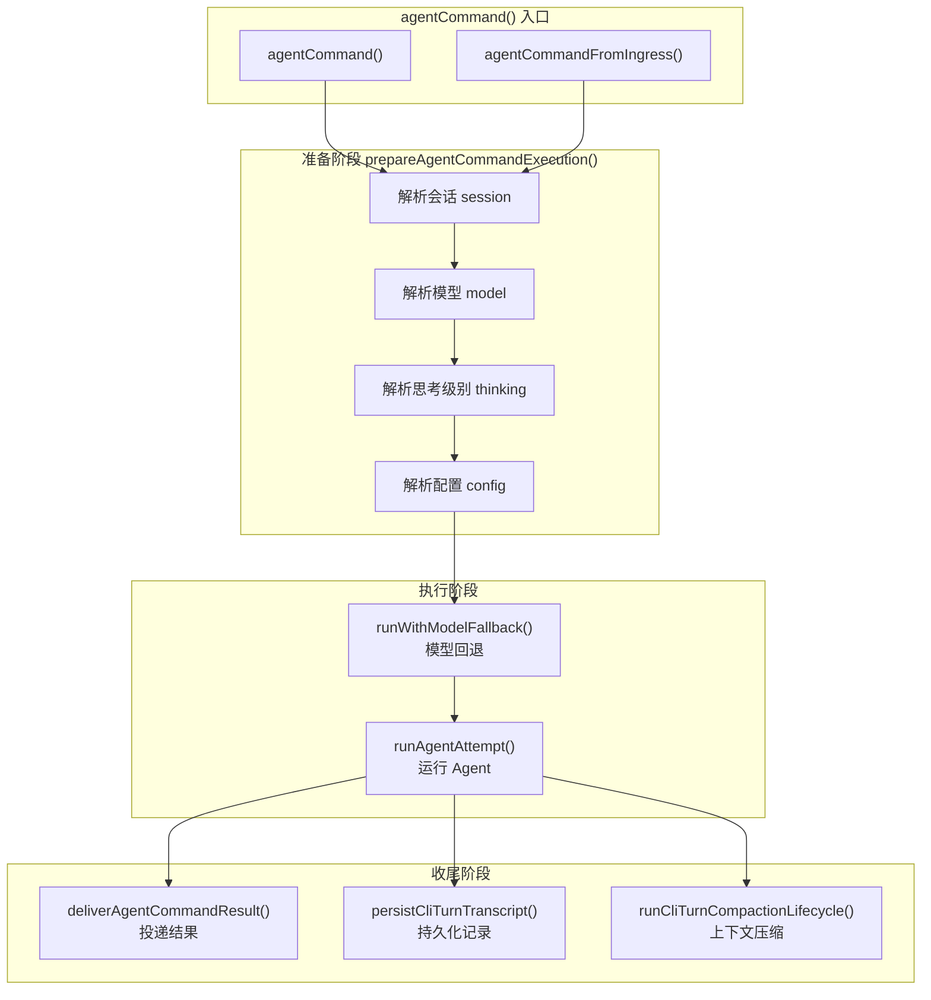
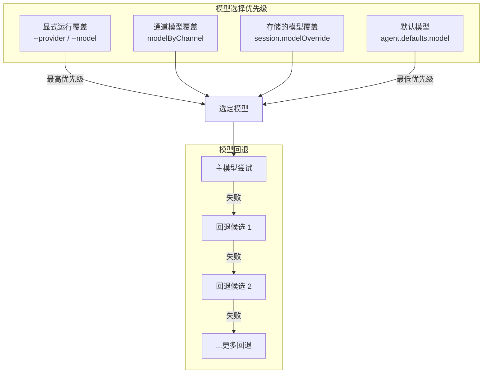

# 第四章：Agent 核心循环

本章深入讲解 OpenClaw 最核心的部分——**Agent 核心循环**（agent loop）。这是 Agent 的大脑，负责协调 LLM 调用、工具执行、消息队列和事件分发。

## 4.1 整体流程概览



## 4.2 入口函数

`agent-loop.ts` 提供了四个主要入口函数，分为**同步流式**和**异步回调**两组：

### 4.2.1 流式入口（返回 EventStream）

```typescript
// packages/agent-core/src/agent-loop.ts

/** 从新的 prompt 开始，返回事件流 */
export function agentLoop(
  prompts: AgentMessage[],
  context: AgentContext,
  config: AgentLoopConfig,
  signal?: AbortSignal,
  streamFn?: StreamFn,
  runtime?: AgentCoreStreamRuntimeDeps,
): EventStream<AgentEvent, AgentMessage[]>;

/** 从现有上下文继续，返回事件流 */
export function agentLoopContinue(
  context: AgentContext,
  config: AgentLoopConfig,
  signal?: AbortSignal,
  streamFn?: StreamFn,
  runtime?: AgentCoreStreamRuntimeDeps,
): EventStream<AgentEvent, AgentMessage[]>;
```

### 4.2.2 异步回调入口（接收 EventSink）

```typescript
/** 从新的 prompt 开始，通过 emit 回调发布事件 */
export async function runAgentLoop(
  prompts: AgentMessage[],
  context: AgentContext,
  config: AgentLoopConfig,
  emit: AgentEventSink,   // (event: AgentEvent) => Promise<void> | void
  signal?: AbortSignal,
  streamFn?: StreamFn,
  runtime?: AgentCoreStreamRuntimeDeps,
): Promise<AgentMessage[]>;

/** 从现有上下文继续，通过 emit 回调发布事件 */
export async function runAgentLoopContinue(
  context: AgentContext,
  config: AgentLoopConfig,
  emit: AgentEventSink,
  signal?: AbortSignal,
  streamFn?: StreamFn,
  runtime?: AgentCoreStreamRuntimeDeps,
): Promise<AgentMessage[]>;
```

### 两组入口的关系



流式入口创建 `EventStream` 对象，将事件推入流中，适合 UI 层通过 `for await...of` 消费。异步回调入口则直接调用 `emit` 回调，适合 `Agent` 类内部使用（它通过 `subscribe` 机制管理监听器）。

## 4.3 runLoop() 主循环

这是整个 Agent 的核心所在。`runLoop()` 函数是一个 `while(true)` 循环，持续执行直到没有更多工作要做：

```typescript
async function runLoop(
  initialContext: AgentContext,
  newMessages: AgentMessage[],
  initialConfig: AgentLoopConfig,
  signal: AbortSignal | undefined,
  emit: AgentEventSink,
  streamFn?: StreamFn,
  runtime?: AgentCoreStreamRuntimeDeps,
): Promise<void> {
  let currentContext = initialContext;
  let config = initialConfig;
  let firstTurn = true;
  let turnOpen = true;
  let pendingMessages: AgentMessage[] = (await config.getSteeringMessages?.()) || [];

  // 外层循环：处理 follow-up 消息
  while (true) {
    let hasMoreToolCalls = true;

    // 内层循环：处理工具调用和 steering 消息
    while (hasMoreToolCalls || pendingMessages.length > 0) {
      // 检查中止信号
      if (await stopIfAborted()) return;

      // 发出 turn_start 事件
      if (!firstTurn) {
        await emit({ type: "turn_start" });
        turnOpen = true;
      } else {
        firstTurn = false;
      }

      // 处理 pending 消息（注入到上下文）
      if (pendingMessages.length > 0) {
        for (const message of pendingMessages) {
          await emit({ type: "message_start", message });
          await emit({ type: "message_end", message });
          currentContext.messages.push(message);
          newMessages.push(message);
        }
      }

      // 流式获取 assistant 响应
      const message = await streamAssistantResponse(
        currentContext, config, signal, emit, streamFn, runtime,
      );
      newMessages.push(message);

      // 处理错误/中止
      if (message.stopReason === "error" || message.stopReason === "aborted") {
        await emit({ type: "turn_end", message, toolResults: [] });
        await emit({ type: "agent_end", messages: newMessages });
        return;
      }

      // 提取工具调用
      const toolCalls = message.content.filter((c) => c.type === "toolCall");
      const toolResults: ToolResultMessage[] = [];
      hasMoreToolCalls = false;

      if (message.stopReason === "toolUse" && toolCalls.length > 0) {
        const executedToolBatch = await executeToolCalls(
          currentContext, message, config, signal, emit,
        );
        toolResults.push(...executedToolBatch.messages);
        hasMoreToolCalls = !executedToolBatch.terminate;

        // 将工具结果追加到上下文
        for (const result of toolResults) {
          currentContext.messages.push(result);
          newMessages.push(result);
        }
      }

      // 结束本轮
      await emit({ type: "turn_end", message, toolResults });
      turnOpen = false;

      // prepareNextTurn 钩子
      const nextTurnContext = { message, toolResults, context: currentContext, newMessages };
      const nextTurnSnapshot = await config.prepareNextTurn?.(nextTurnContext);
      if (nextTurnSnapshot) {
        currentContext = nextTurnSnapshot.context ?? currentContext;
        config = updateConfig(config, nextTurnSnapshot);
      }

      // shouldStopAfterTurn 检查
      if (await config.shouldStopAfterTurn?.(nextTurnContext)) {
        await emit({ type: "agent_end", messages: newMessages });
        return;
      }

      // 获取新的 steering 消息
      pendingMessages = (await config.getSteeringMessages?.()) || [];
    }

    // 检查 follow-up 消息
    const followUpMessages = (await config.getFollowUpMessages?.()) || [];
    if (followUpMessages.length > 0) {
      pendingMessages = followUpMessages;
      continue;
    }

    // 没有更多消息，退出
    break;
  }

  await emit({ type: "agent_end", messages: newMessages });
}
```

### 循环流程详解



## 4.4 streamAssistantResponse() — LLM 调用

这是将 Agent 上下文转换为 LLM 请求并处理流式响应的关键函数：

```typescript
async function streamAssistantResponse(
  context: AgentContext,
  config: AgentLoopConfig,
  signal: AbortSignal | undefined,
  emit: AgentEventSink,
  streamFn?: StreamFn,
  runtime?: AgentCoreStreamRuntimeDeps,
): Promise<AssistantMessage> {
  // 1. 上下文变换（AgentMessage[] → AgentMessage[]）
  let messages = context.messages;
  if (config.transformContext) {
    messages = await config.transformContext(messages, signal);
  }

  // 2. 转换为 LLM 兼容格式（AgentMessage[] → Message[]）
  const llmMessages = await config.convertToLlm(messages);

  // 3. 构建 LLM 上下文
  const llmContext: Context = {
    systemPrompt: context.systemPrompt,
    messages: llmMessages,
    tools: context.tools,
  };

  // 4. 解析流式函数
  const streamFunction = resolveAgentCoreStreamFn(runtime, streamFn);

  // 5. 解析 API key（动态获取，对短生命期令牌重要）
  const resolvedApiKey =
    (config.getApiKey ? await config.getApiKey(config.model.provider) : undefined) || config.apiKey;

  // 6. 调用 LLM
  const response = await streamFunction(config.model, llmContext, {
    ...config,
    apiKey: resolvedApiKey,
    signal,
  });

  // 7. 处理流式事件
  let partialMessage: AssistantMessage | null = null;
  let addedPartial = false;

  for await (const event of response) {
    switch (event.type) {
      case "start": {
        const message = event.partial;
        partialMessage = message;
        context.messages.push(message);
        addedPartial = true;
        await emit({ type: "message_start", message: { ...message } });
        break;
      }
      case "text_delta":
      case "thinking_delta":
      // ... 其他流式事件
        if (partialMessage) {
          const message = resolveAssistantMessageUpdate(event, partialMessage);
          partialMessage = message;
          context.messages[context.messages.length - 1] = message;
          await emit({ type: "message_update", assistantMessageEvent: event, message: { ...message } });
        }
        break;
      case "done":
      case "error": {
        const finalMessage = removeNonExecutableToolCalls(await response.result());
        // ... 更新上下文，发出 message_end 事件
        return finalMessage;
      }
    }
  }
}
```

### 数据流转换



## 4.5 事件流系统

### 4.5.1 EventStream 创建

```typescript
function createAgentStream(): EventStream<AgentEvent, AgentMessage[]> {
  return new EventStreamConstructor<AgentEvent, AgentMessage[]>(
    (event: AgentEvent) => event.type === "agent_end",               // isDone 判断
    (event: AgentEvent) => (event.type === "agent_end" ? event.messages : []), // getResult
  );
}
```

`EventStream` 是一个可观察的流，它：
- 继承自 `AsyncIterable`，可以通过 `for await...of` 消费
- 在 `agent_end` 事件时标记为完成
- 结束时返回 `AgentMessage[]`（本轮新增的消息）

### 4.5.2 完整事件序列

```mermaid
sequenceDiagram
    participant UI as UI 层
    participant Agent as Agent 实例
    participant Loop as agent-loop

    UI->>Agent: prompt("Hello")
    Agent->>Loop: runAgentLoop()
    Loop-->>UI: agent_start
    Loop-->>UI: turn_start
    Loop-->>UI: message_start (user message)
    Loop-->>UI: message_end (user message)
    Loop-->>UI: message_start (assistant, partial)
    Loop-->>UI: message_update (text_delta)
    Loop-->>UI: message_update (text_delta)
    Loop-->>UI: message_update (toolcall_start)
    Loop-->>UI: message_end (assistant, final)
    Loop-->>UI: tool_execution_start (tool-1)
    Loop-->>UI: tool_execution_start (tool-2)
    Loop-->>UI: tool_execution_update (tool-1 progress)
    Loop-->>UI: tool_execution_end (tool-1)
    Loop-->>UI: tool_execution_end (tool-2)
    Loop-->>UI: message_start (toolResult-1)
    Loop-->>UI: message_end (toolResult-1)
    Loop-->>UI: message_start (toolResult-2)
    Loop-->>UI: message_end (toolResult-2)
    Loop-->>UI: turn_end
    Loop-->>UI: agent_end [messages]
```

### 4.5.3 事件类型汇总

| 事件类型 | 含义 | 触发时机 |
|---------|------|---------|
| `agent_start` | Agent 运行开始 | 循环开始时 |
| `turn_start` | 新轮次开始 | 每次 LLM 调用前 |
| `message_start` | 消息开始 | 消息加入上下文时 |
| `message_update` | 流式消息更新 | assistant 流式响应中 |
| `message_end` | 消息结束 | 消息完成时 |
| `tool_execution_start` | 工具开始执行 | 工具准备就绪时 |
| `tool_execution_update` | 工具执行进度 | 工具执行中 |
| `tool_execution_end` | 工具执行完成 | 工具执行后 |
| `turn_end` | 轮次结束 | 工具结果处理后 |
| `agent_end` | Agent 运行结束 | 所有工作完成时 |

## 4.6 AgentLoopConfig 回调详解

### 4.6.1 convertToLlm

将 `AgentMessage[]` 转换为 LLM 兼容的 `Message[]`。每个 `AgentMessage` 必须被转换为 `UserMessage`、`AssistantMessage` 或 `ToolResultMessage`。无法转换的消息（如 UI 通知）应被过滤掉。

```typescript
// 默认实现
function defaultConvertToLlm(messages: AgentMessage[]): Message[] {
  return messages.filter(
    (message) =>
      message.role === "user" || message.role === "assistant" || message.role === "toolResult",
  );
}
```

### 4.6.2 transformContext

在 `convertToLlm` 之前对 `AgentMessage[]` 进行变换，适用于：
- **上下文窗口管理**：裁剪过长的历史记录
- **外部上下文注入**：从外部源注入额外信息

```typescript
// 示例：上下文裁剪
transformContext: async (messages) => {
  if (estimateTokens(messages) > MAX_TOKENS) {
    return pruneOldMessages(messages);
  }
  return messages;
}
```

### 4.6.3 getApiKey

动态解析 API key，对短生命期 OAuth 令牌（如 GitHub Copilot）特别有用——这些令牌可能在长时间的工具执行阶段过期，需要在每次 LLM 调用时重新获取。

### 4.6.4 beforeToolCall

工具执行前的钩子，可以**阻断**工具调用：

```typescript
export interface BeforeToolCallResult {
  block?: boolean;   // true 表示阻断执行
  reason?: string;   // 阻断原因
}
```

### 4.6.5 afterToolCall

工具执行后的钩子，可以**修改**工具结果：

```typescript
export interface AfterToolCallResult {
  content?: (TextContent | ImageContent)[];  // 替换内容
  details?: unknown;                         // 替换详情
  isError?: boolean;                         // 替换错误标志
  terminate?: boolean;                       // 提示提前终止
}
```

`terminate` 的特殊语义：当**同一批**所有工具结果都设置了 `terminate: true` 时，Agent 循环会在本轮结束后停止，不再继续 LLM 调用。

### 4.6.6 prepareNextTurn

轮次之间的准备钩子，可以更新模型、推理级别或上下文：

```typescript
export interface AgentLoopTurnUpdate {
  context?: AgentContext;  // 替换上下文
  model?: Model;           // 替换模型
  thinkingLevel?: ThinkingLevel; // 替换思考级别
}
```

### 4.6.7 getSteeringMessages / getFollowUpMessages



## 4.7 工具执行

### 4.7.1 executionMode 策略

```typescript
export type ToolExecutionMode = "sequential" | "parallel";
```

#### 顺序执行（sequential）



#### 并行执行（parallel）



### 4.7.2 工具参数验证

使用 TypeBox schema 进行参数验证：

```typescript
// packages/agent-core/src/validation.ts
export { validateToolArguments, validateToolCall } from "@openclaw/ai/validation";
```

验证流程：

```typescript
async function prepareToolCall(
  currentContext: AgentContext,
  assistantMessage: AssistantMessage,
  toolCall: AgentToolCall,
  config: AgentLoopConfig,
  signal: AbortSignal | undefined,
  resolvedToolCalls: Map<AgentToolCall, ResolvedToolCallOutcome>,
): Promise<PreparedToolCall | ImmediateToolCallOutcome> {
  // 1. 解析工具（查找或延迟解析）
  const resolution = await resolveToolCallTool(...);

  // 2. prepareArguments（参数兼容性 shim）
  let preparedToolCall = prepareToolCallArguments(tool, toolCall);

  // 3. validateToolArguments（TypeBox schema 验证）
  let validatedArgs = validateToolArguments(tool, preparedToolCall);

  // 4. beforeToolCall 钩子（可阻断）
  const beforeResult = await config.beforeToolCall?.({ ... });

  // 5. 如果任何步骤失败，返回 ImmediateToolCallOutcome
  // 6. 全部通过，返回 PreparedToolCall
}
```

### 4.7.3 错误处理



## 4.8 Agent 命令编排

在 OpenClaw 的应用层，`src/agents/agent-command.ts` 负责将用户输入编排为一次完整的 Agent 运行。它是 `agent-core` 与 OpenClaw 会话管理、模型选择、权限控制之间的桥梁。

### 4.8.1 执行流程



### 4.8.2 模型选择与回退



### 8.3 会话生命周期管理

`agent-command.ts` 管理会话的完整生命周期：

1. **会话锁定**：通过 `beginSessionWorkAdmission()` 确保同一会话不会同时运行多个 Agent。
2. **状态持久化**：每次运行结束后更新 `SessionEntry`，包括模型、token 用量、思考级别等。
3. **上下文压缩**：通过 `runCliTurnCompactionLifecycle()` 在必要时压缩对话历史。
4. **投递结果**：通过 `deliverAgentCommandResult()` 将结果投递到目标通道（如 Slack、Discord 等）。

## 4.9 总结

Agent 核心循环是整个 OpenClaw 系统的中枢神经系统。它通过精心的分层设计，将 LLM 调用、工具执行、消息队列和事件分发有机地结合起来。

| 组件 | 职责 |
|------|------|
| `agentLoop()` / `agentLoopContinue()` | 流式入口，返回 `EventStream` |
| `runAgentLoop()` / `runAgentLoopContinue()` | 异步回调入口，接收 `EventSink` |
| `runLoop()` | 主循环，协调所有步骤 |
| `streamAssistantResponse()` | LLM 调用与流式响应处理 |
| `executeToolCalls()` | 工具执行调度（顺序/并行） |
| `EventStream` | 事件流，连接 Agent 与 UI |

下一章将介绍 **工具系统**——Agent 如何通过工具描述符、规划器和协议转换与外部世界交互。

> 延伸阅读：如果你想先动手写代码，也可以直接跳转到 [第 11 章](ch11-minimal-agent/README.md) 从零搭建一个完整的最小 Agent 实现。