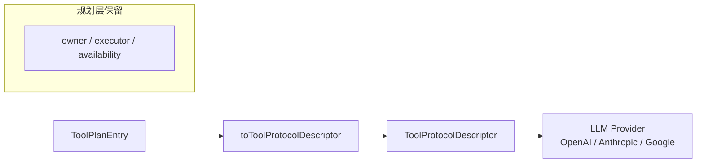
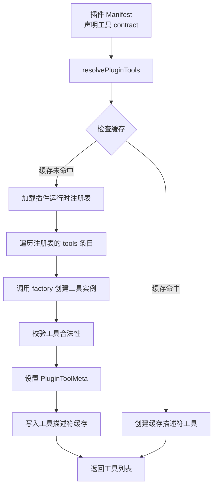

# 第五章：工具系统

工具系统是 OpenClaw 中连接 LLM 与外部世界的桥梁。LLM 本身无法执行代码、读写文件、搜索网络或调用 API——工具系统将这些能力以标准化的方式暴露给模型，让 Agent 能够与真实环境交互。

## 5.1 三层架构概览

OpenClaw 的工具系统由三个逻辑层组成：

```mermaid
graph TB
    subgraph "Layer 1: 工具描述符 Tool Descriptors"
        TD[ToolDescriptor<br/>name / description / inputSchema<br/>owner / executor / availability]
    end

    subgraph "Layer 2: 工具规划器 Tool Planner"
        TP[buildToolPlan<br/>排序 → 可用性评估 → 契约检查]
        TP --> V[可见工具列表<br/>ToolPlanEntry[]]
        TP --> H[隐藏工具列表<br/>HiddenToolPlanEntry[]]
    end

    subgraph "Layer 3: 协议转换 Protocol"
        PR[toToolProtocolDescriptor<br/>转换为 LLM 可理解的协议格式]
        PR --> PD[ToolProtocolDescriptor<br/>name / description / inputSchema]
    end

    TD --> TP
    TP --> PR
```

- **Layer 1 — 工具描述符**：定义工具的元数据，包括名称、描述、输入 Schema、拥有者、执行器和可用性条件。
- **Layer 2 — 工具规划器**：接收一组描述符，根据运行时上下文（认证、配置、环境变量等）评估哪些工具可见，并执行契约检查（如名称唯一性）。
- **Layer 3 — 协议转换**：将规划后的可见工具条目转换为 LLM 提供商可理解的协议格式。

## 5.2 ToolDescriptor 类型系统

工具描述符的核心类型定义在 `src/tools/types.ts` 中，是整个工具系统的数据基础。

### 5.2.1 ToolDescriptor

```typescript
// src/tools/types.ts
export type ToolDescriptor = {
  readonly name: string;
  readonly title?: string;
  readonly description: string;
  readonly inputSchema: JsonObject;
  readonly outputSchema?: JsonObject;
  readonly owner: ToolOwnerRef;
  readonly executor?: ToolExecutorRef;
  readonly availability?: ToolAvailabilityExpression;
  readonly annotations?: JsonObject;
  readonly sortKey?: string;
};
```

每个字段的含义：
- `name` — 工具的唯一标识符，LLM 通过此名称调用工具。
- `description` — 工具的自然语言描述，LLM 据此决定何时使用该工具。
- `inputSchema` — JSON Schema 格式的输入参数定义，LLM 据此生成合法的参数。
- `owner` — 工具的拥有者，用于追踪工具的来源（见下文）。
- `executor` — 工具的执行器引用，规划器通过它找到实际执行代码。
- `availability` — 工具的可用性条件，决定工具在何种上下文中可见。
- `sortKey` — 排序键，用于控制工具在列表中的展示顺序。

### 5.2.2 ToolOwnerRef

`ToolOwnerRef` 标明工具的"所有者"——谁定义了该工具的描述符：

```typescript
// src/tools/types.ts
export type ToolOwnerRef =
  | { readonly kind: "core" }
  | { readonly kind: "plugin"; readonly pluginId: string }
  | { readonly kind: "channel"; readonly channelId: string; readonly pluginId?: string }
  | { readonly kind: "mcp"; readonly serverId: string };
```

四种来源：
- **core** — 核心工具，由 OpenClaw 内置提供（如文件读写、代码搜索等）。
- **plugin** — 插件注册的工具，通过插件 SDK 的 `setPluginToolMeta` 注册。
- **channel** — 通道（IM 平台）注册的工具，如 Slack 的消息发送工具。
- **mcp** — 通过 MCP（Model Context Protocol）服务器注册的工具。

### 5.2.3 ToolExecutorRef

`ToolExecutorRef` 标明工具的执行器——谁负责运行该工具：

```typescript
// src/tools/types.ts
export type ToolExecutorRef =
  | { readonly kind: "core"; readonly executorId: string }
  | { readonly kind: "plugin"; readonly pluginId: string; readonly toolName: string }
  | { readonly kind: "channel"; readonly channelId: string; readonly actionId: string }
  | { readonly kind: "mcp"; readonly serverId: string; readonly toolName: string };
```

`owner` 和 `executor` 分离的设计使得工具的定义和实现可以属于不同的模块。例如，一个通道可以"拥有"一个工具描述符，但将执行委托给插件。

### 5.2.4 ToolAvailabilityExpression

工具并非在所有上下文中都可用。`ToolAvailabilityExpression` 定义了工具可见的条件：

```typescript
// src/tools/types.ts
export type ToolAvailabilitySignal =
  | { readonly kind: "always" }
  | { readonly kind: "auth"; readonly providerId: string }
  | {
      readonly kind: "config";
      readonly path: readonly string[];
      readonly check?: "exists" | "non-empty" | "available";
    }
  | { readonly kind: "env"; readonly name: string }
  | { readonly kind: "plugin-enabled"; readonly pluginId: string }
  | { readonly kind: "context"; readonly key: string; readonly equals?: JsonPrimitive };

export type ToolAvailabilityExpression =
  | ToolAvailabilitySignal
  | { readonly allOf: readonly ToolAvailabilityExpression[] }
  | { readonly anyOf: readonly ToolAvailabilityExpression[] };
```

可用性信号的种类：

| 信号 | 含义 | 示例 |
|------|------|------|
| `always` | 始终可用 | 核心工具默认值 |
| `auth` | 需要特定认证提供商 | 需要 `github` 认证 |
| `config` | 需要配置中存在某路径 | 需要 `sandbox.enabled` 配置 |
| `env` | 需要环境变量 | 需要 `OPENAI_API_KEY` |
| `plugin-enabled` | 需要插件已启用 | 需要 `codebase-search` 插件 |
| `context` | 需要运行时上下文值 | 需要 `workspace` 不为空 |

`allOf` 和 `anyOf` 支持组合表达式，实现复杂的可用性逻辑。

### 5.2.5 规划输出类型

规划器的输出分为可见和隐藏两组：

```typescript
// src/tools/types.ts
export type ToolPlanEntry = {
  readonly descriptor: ToolDescriptor;
  readonly executor: ToolExecutorRef;
};

export type HiddenToolPlanEntry = {
  readonly descriptor: ToolDescriptor;
  readonly diagnostics: readonly ToolAvailabilityDiagnostic[];
};

export type ToolPlan = {
  readonly visible: readonly ToolPlanEntry[];
  readonly hidden: readonly HiddenToolPlanEntry[];
};
```

`ToolPlan` 同时包含可见和隐藏的工具，这使得 UI 可以展示"为什么某些工具不可用"的说明。

## 5.3 工具规划器

规划器（`src/tools/planner.ts`）是一个**确定性**的纯函数，它接收描述符列表和可用性上下文，输出规划结果。

```mermaid
graph LR
    A[ToolDescriptor[]] --> B[排序 compareDescriptors]
    B --> C[唯一性检查 assertUniqueNames]
    C --> D{遍历每个描述符}
    D --> E[可用性评估]
    E -->|可用| F{有 executor?}
    F -->|是| G[加入 visible]
    F -->|否| H[抛出 ToolPlanContractError]
    E -->|不可用| I[加入 hidden]
    G --> J[返回 ToolPlan]
    I --> J
```

### 5.3.1 buildToolPlan

```typescript
// src/tools/planner.ts
export function buildToolPlan(options: BuildToolPlanOptions): ToolPlan {
  const descriptors = options.descriptors.toSorted(compareDescriptors);
  assertUniqueNames(descriptors);

  const visible: ToolPlanEntry[] = [];
  const hidden: HiddenToolPlanEntry[] = [];

  for (const descriptor of descriptors) {
    const diagnostics = [
      ...evaluateToolAvailability({ descriptor, context: options.availability }),
    ];
    if (diagnostics.length > 0) {
      hidden.push({ descriptor, diagnostics });
      continue;
    }
    if (!descriptor.executor) {
      throw new ToolPlanContractError({
        code: "missing-executor",
        toolName: descriptor.name,
        message: `Visible tool descriptor has no executor ref: ${descriptor.name}`,
      });
    }
    visible.push({ descriptor, executor: descriptor.executor });
  }

  return { visible, hidden };
}
```

规划器的核心逻辑：

1. **排序**：使用 `toSorted` 按 `sortKey`（或 `name`）排序，保证输出确定性。
2. **唯一性检查**：`assertUniqueNames` 确保所有可见工具的名称不重复。
3. **可用性评估**：对每个描述符运行 `evaluateToolAvailability`。
4. **契约检查**：可见工具必须有 `executor`，否则抛出 `ToolPlanContractError`。

### 5.3.2 ToolPlanContractError

```typescript
// src/tools/diagnostics.ts
export type ToolPlanContractErrorCode = "duplicate-tool-name" | "missing-executor";

export class ToolPlanContractError extends Error {
  readonly code: ToolPlanContractErrorCode;
  readonly toolName: string;

  constructor(params: { code: ToolPlanContractErrorCode; toolName: string; message: string }) {
    super(params.message);
    this.name = "ToolPlanContractError";
    this.code = params.code;
    this.toolName = params.toolName;
  }
}
```

两种契约错误：

- **`duplicate-tool-name`**：两个描述符同名，无法确定 LLM 调用哪个。
- **`missing-executor`**：工具通过了可用性检查但没有执行器，无法运行。

## 5.4 可用性评估

可用性评估模块（`src/tools/availability.ts`）实现 `evaluateToolAvailability` 函数，将 `ToolAvailabilityExpression` 转化为诊断信息。

### 5.4.1 评估流程

```typescript
// src/tools/availability.ts
export function evaluateToolAvailability(params: {
  descriptor: ToolDescriptor;
  context?: ToolAvailabilityContext;
}): readonly ToolAvailabilityDiagnostic[] {
  const context = params.context ?? {};
  const availability = params.descriptor.availability ?? { kind: "always" };
  if (!hasAvailabilityExpressionShape(availability)) {
    return [{ reason: "unsupported-signal", message: "Unsupported availability expression" }];
  }
  return evaluateExpression(availability, context);
}
```

每个信号类型的评估逻辑：

- **`auth`**：检查 `context.authProviderIds` 是否包含目标提供商 ID。
- **`config`**：沿路径解析配置值，根据 `check` 模式（`exists` / `non-empty` / `available`）判断。
- **`env`**：检查环境变量是否存在且非空。
- **`plugin-enabled`**：检查 `context.enabledPluginIds` 是否包含插件 ID。
- **`context`**：检查上下文值是否匹配（可选 `equals` 比较）。
- **`allOf`**：所有子表达式必须通过，任何失败即记入诊断。
- **`anyOf`**：任一子表达式通过即可，但 `unsupported-signal` 级别的错误仍会保留。

### 5.4.2 ToolAvailabilityContext

```typescript
// src/tools/types.ts
export type ToolAvailabilityContext = {
  readonly authProviderIds?: ReadonlySet<string>;
  readonly config?: JsonObject;
  readonly isConfigValueAvailable?: (params: { ... }) => boolean;
  readonly env?: Readonly<Record<string, string | undefined>>;
  readonly enabledPluginIds?: ReadonlySet<string>;
  readonly values?: Readonly<Record<string, JsonPrimitive | undefined>>;
};
```

这个上下文对象由运行时在每次构建工具计划时提供，反映了当前会话的运行时状态。

## 5.5 协议转换

规划完成后，可见工具需要转换为 LLM 提供商能够理解的格式。协议转换模块（`src/tools/protocol.ts`）负责此任务：

```typescript
// src/tools/protocol.ts
export type ToolProtocolDescriptor = {
  readonly name: string;
  readonly description: string;
  readonly inputSchema: JsonObject;
};

export function toToolProtocolDescriptor(entry: ToolPlanEntry): ToolProtocolDescriptor {
  return {
    name: entry.descriptor.name,
    description: entry.descriptor.description,
    inputSchema: entry.descriptor.inputSchema,
  };
}

export function toToolProtocolDescriptors(
  entries: readonly ToolPlanEntry[],
): readonly ToolProtocolDescriptor[] {
  return entries.map(toToolProtocolDescriptor);
}
```

协议转换是**精简**的——只保留 LLM 所需的三个字段：`name`、`description` 和 `inputSchema`。`owner`、`executor`、`availability` 等元数据在规划层使用，不会被传递给 LLM。



## 5.6 内置工具概览

OpenClaw 提供了大量内置工具，集中在 `src/agents/tools/` 目录下。这些工具覆盖了 Agent 运行所需的各种能力。

### 5.6.1 工具分类

| 类别 | 工具文件 | 功能 |
|------|----------|------|
| **文件操作** | `web-fetch.ts`, `web-search.ts` | 网络请求和搜索 |
| **文件系统** | 文件读写工具 | 读、写、编辑文件 |
| **代码搜索** | `Glob 工具`, `Grep 工具` | 代码搜索和模式匹配 |
| **消息交互** | `message-tool.ts` | 向用户发送消息 |
| **子 Agent** | `subagents-tool.ts` | 启动子 Agent 执行任务 |
| **会话管理** | `sessions-*.ts` | 会话创建、发送、历史 |
| **定时任务** | `cron-tool.ts` | 定时执行任务 |
| **媒体生成** | `image-generate-tool.ts`, `music-generate-tool.ts`, `video-generate-tool.ts` | 图片、音乐、视频生成 |
| **PDF 处理** | `pdf-tool.ts` | PDF 读取和解析 |
| **节点管理** | `nodes-tool.ts` | 工作空间节点操作 |
| **目标管理** | `goal-tools.ts` | 目标追踪和管理 |
| **网关调用** | `gateway-tool.ts` | 跨网关工具调用 |

### 5.6.2 通用工具模式

所有内置工具遵循统一的接口模式。核心类型定义在 `src/agents/tools/common.ts` 中：

```typescript
// src/agents/tools/common.ts
export type AnyAgentTool = Omit<AgentTool, "execute"> &
  ErasedAgentToolExecute & {
    displaySummary?: string;
    prepareBeforeToolCallParams?: ...;
    finalizeBeforeToolCallParams?: ...;
  };
```

**工具结果辅助函数：**

```typescript
// src/agents/tools/tool-results.ts
export function textResult<TDetails>(text: string, details: TDetails): AgentToolResult<TDetails> {
  return {
    content: [{ type: "text", text }],
    details,
  };
}

export function jsonResult<TDetails>(payload: TDetails): AgentToolResult<TDetails> {
  return textResult(JSON.stringify(payload, null, 2), payload);
}
```

**错误处理：**

```typescript
// src/agents/tools/common.ts
export class ToolInputError extends Error {
  readonly status: number = 400;
  constructor(message: string) {
    super(message);
    this.name = "ToolInputError";
  }
}

export class ToolAuthorizationError extends ToolInputError {
  override readonly status = 403;
  constructor(message: string) {
    super(message);
    this.name = "ToolAuthorizationError";
  }
}
```

- `ToolInputError`（HTTP 400）— 参数校验失败，如缺少必填字段。
- `ToolAuthorizationError`（HTTP 403）— 权限不足，如用户未认证。

**参数读取辅助函数**提供了 `readStringParam`、`readNumberParam`、`readStringArrayParam` 等类型安全的方法，用于从 LLM 生成的参数中提取值。

### 5.6.3 典型工具实现示例

一个内置工具的典型实现模式如下：

```typescript
// 伪代码——展示工具实现的通用模式
const myTool: AnyAgentTool = {
  name: "my_tool",
  label: "我的工具",
  description: "执行某个特定操作",
  parameters: {
    type: "object",
    properties: {
      input: { type: "string", description: "输入参数" },
    },
    required: ["input"],
  },
  async execute(toolCallId, params, signal, onUpdate) {
    const { input } = params as { input?: string };
    if (!input) throw new ToolInputError("input required");
    // 执行工具逻辑...
    return textResult("操作完成", { result: "success" });
  },
};
```

## 5.7 插件工具注册

插件系统允许第三方扩展工具集。插件工具注册机制在 `src/plugins/tools.ts` 中实现。

### 5.7.1 PluginToolMeta

```typescript
// src/plugins/tools.ts
export type PluginToolMeta = {
  pluginId: string;
  optional: boolean;
  replaySafe?: boolean;
  trustedLocalMedia?: boolean;
  mcp?: PluginToolMcpMeta;
};
```

每个插件工具实例都关联一个 `PluginToolMeta` 元数据，用于追踪工具归属和属性。

### 5.7.2 setPluginToolMeta / getPluginToolMeta

```typescript
// src/plugins/tools.ts
const pluginToolMeta = new WeakMap<AnyAgentTool, PluginToolMeta>();

export function setPluginToolMeta(tool: AnyAgentTool, meta: PluginToolMeta): void {
  pluginToolMeta.set(tool, meta);
}

export function getPluginToolMeta(tool: AnyAgentTool): PluginToolMeta | undefined {
  return pluginToolMeta.get(tool);
}
```

使用 `WeakMap` 存储元数据，不会阻止工具对象的垃圾回收。当工具被包装代理替换时，`copyPluginToolMeta` 负责复制元数据。

### 5.7.3 插件工具注册流程



关键步骤：

1. `resolvePluginTools` 是插件工具解析的入口函数。
2. 首先尝试从缓存读取工具描述符（`readCachedPluginToolDescriptors`）。
3. 如果缓存未命中或无覆盖，则加载插件运行时注册表。
4. 对每个 `PluginToolRegistration` 条目，调用其 `factory` 函数创建工具实例。
5. 验证工具合法性（`describeMalformedPluginTool`：必须有 `name`、`execute`、`parameters`）。
6. 通过 `setPluginToolMeta` 记录插件归属。
7. 将工具描述符写入缓存，加速后续请求。

### 5.7.4 作用域隔离

插件工具执行时，通过 `wrapPluginToolCallbacks` 和 `Proxy` 实现作用域隔离：

```typescript
// src/plugins/tools.ts
const wrapped = new Proxy<AnyAgentTool>(tool, {
  get(target, prop) {
    if (prop === "prepareArguments" && scopedPrepareArguments) {
      return scopedPrepareArguments;
    }
    if (prop === "execute") {
      return scopedExecute;
    }
    return Reflect.get(target, prop, target);
  },
  ...
});
```

每个插件工具的 `execute` 和 `prepareArguments` 方法被包装在 `withPluginRuntimePluginScope` 中，确保工具执行时的日志、配置、认证等上下文都指向正确的插件。

## 5.8 全流程串联

```mermaid
sequenceDiagram
    participant LLM as LLM 提供商
    participant Loop as Agent 循环
    participant Planner as 工具规划器
    participant Avail as 可用性评估
    participant Protocol as 协议转换
    participant Executor as 工具执行器

    Note over Loop,Executor: 构建工具计划
    Loop->>Planner: buildToolPlan(descriptors, context)
    Planner->>Avail: evaluateToolAvailability()
    Avail-->>Planner: 诊断列表
    Planner-->>Loop: ToolPlan { visible, hidden }

    Note over Loop,Protocol: 转换为 LLM 协议
    Loop->>Protocol: toToolProtocolDescriptors(visible)
    Protocol-->>Loop: ToolProtocolDescriptor[]

    Note over Loop,LLM: LLM 推理
    Loop->>LLM: 发送工具定义 + 用户消息
    LLM-->>Loop: 返回工具调用请求

    Note over Loop,Executor: 执行工具
    Loop->>Executor: 执行工具(name, args)
    Executor-->>Loop: 工具结果

    Note over Loop,LLM: 继续推理
    Loop->>LLM: 发送工具结果
    LLM-->>Loop: 最终回复
```

## 5.9 本章小结

工具系统是 OpenClaw Agent 与外部世界交互的核心桥梁。其设计的关键点包括：

- **三层分离**：描述符定义工具"长什么样"，规划器决定"哪些可见"，协议转换决定"怎么传给 LLM"。
- **确定性规划**：`buildToolPlan` 是纯函数，给定相同的输入永远产生相同的输出。
- **owner/executor 分离**：工具的定义和实现可以分离，便于插件和通道系统扩展。
- **可用性表达式**：通过统一的信号系统，工具可以根据运行时上下文动态决定是否可见。
- **插件工具缓存**：工具描述符缓存避免重复加载，提升性能。
- **作用域隔离**：通过 Proxy 包装实现插件工具执行时的上下文隔离。

---

上一章（[第 4 章](ch04-agent-loop/README.md)）讲解了 Agent 循环如何调用工具，本章讲解了工具的定义与规划机制。下一章将介绍 **LLM 集成**——Agent 循环中 `streamFn` 背后的具体实现，包括 Provider 抽象层、Token 用量归一化、上下文窗口管理和模型选择。

> 🔗 术语呼应：本章的 **`ToolPlan`** 会被转换为 LLM 协议格式发送给模型（第 6 章），工具的 **`owner: "plugin"`** 来源对应第 8 章插件 SDK 注册的工具。