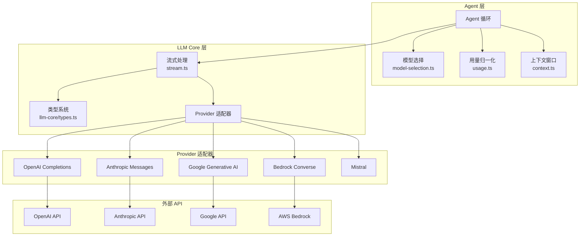
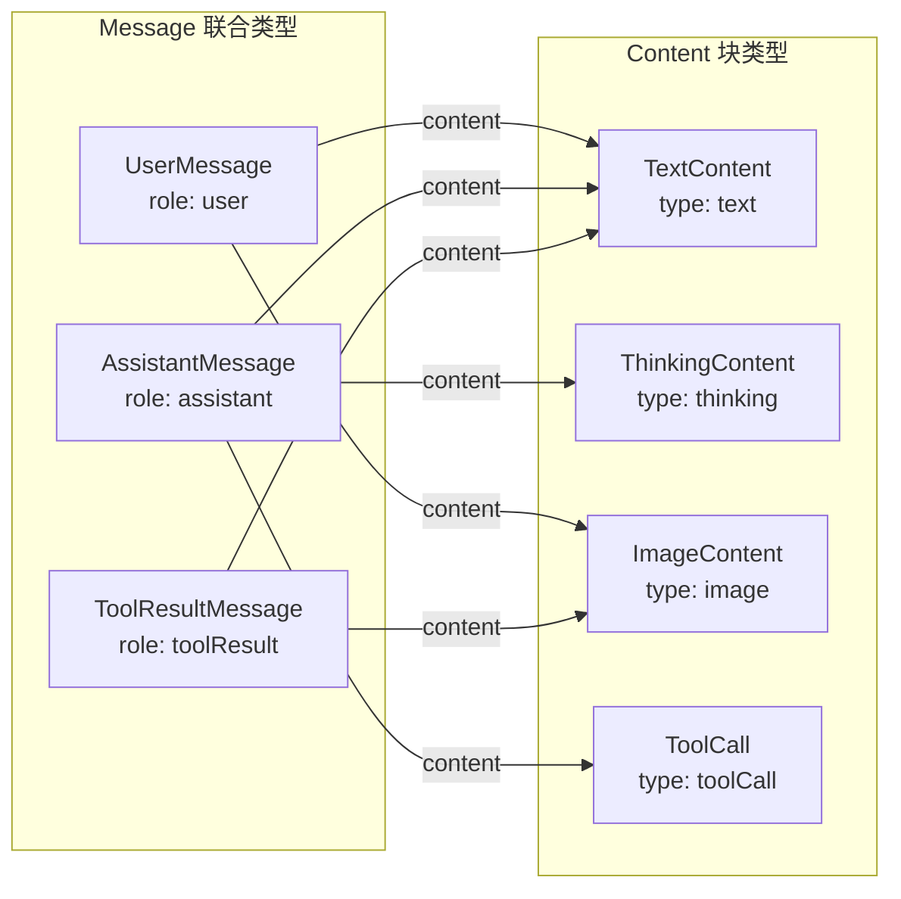
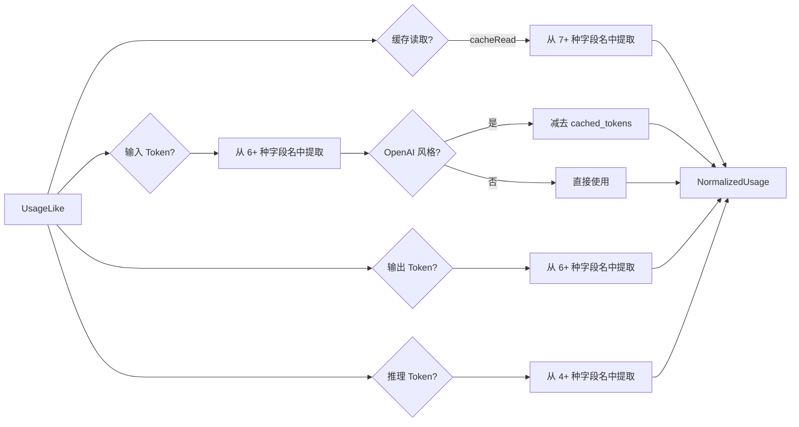
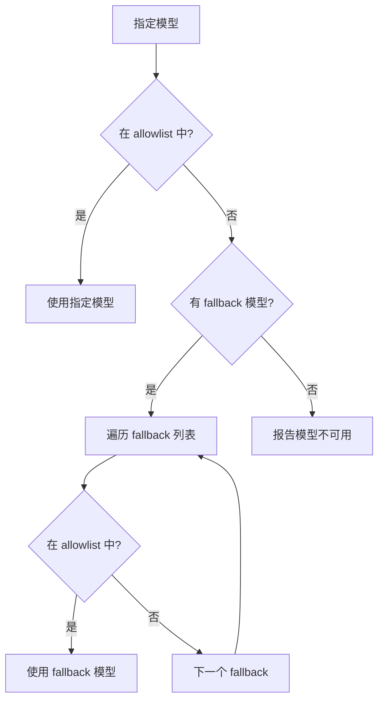
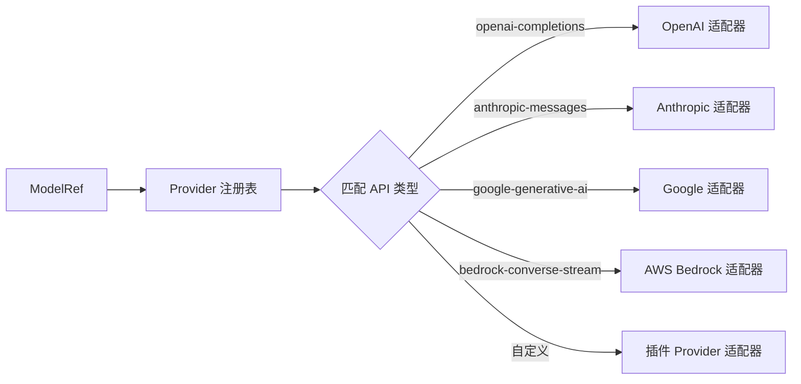

# 第六章：LLM 集成

LLM 集成是 OpenClaw 中连接 Agent 与各类 AI 模型提供商的桥梁。本章深入讲解 LLM 类型系统、Token 用量归一化、上下文窗口管理和模型选择机制。

## 6.1 整体架构



Agent 层负责模型选择、用量记账和上下文窗口管理；LLM Core 层负责统一的流式处理；Provider 适配器负责与具体 API 通信。

## 6.2 LLM 类型系统

`packages/llm-core/src/types.ts` 定义了与 LLM 交互的核心类型。

### 6.2.1 KnownApi — 支持的 API 系列

```typescript
// packages/llm-core/src/types.ts
export type KnownApi =
  | "openai-completions"
  | "mistral-conversations"
  | "openai-responses"
  | "azure-openai-responses"
  | "openai-chatgpt-responses"
  | "anthropic-messages"
  | "bedrock-converse-stream"
  | "google-generative-ai"
  | "google-vertex";
```

`KnownApi` 列出了 OpenClaw 内置适配的 API 系列。`Api` 类型允许自定义提供商使用 `KnownApi` 之外的字符串，实现完全的扩展性。

### 6.2.2 StreamOptions — 流式请求选项

```typescript
// packages/llm-core/src/types.ts
export interface StreamOptions {
  temperature?: number;
  maxTokens?: number;
  stop?: string[];
  signal?: AbortSignal;
  apiKey?: string;
  transport?: Transport;
  cacheRetention?: CacheRetention;
  sessionId?: string;
  promptCacheKey?: string;
  onPayload?: (payload: unknown, model: Model) => MaybePromise<unknown>;
  onResponse?: (response: ProviderResponse, model: Model) => void | Promise<void>;
  headers?: Record<string, string>;
  timeoutMs?: number;
  maxRetries?: number;
  maxRetryDelayMs?: number;
  metadata?: Record<string, unknown>;
}
```

`StreamOptions` 是统一请求选项，所有 Provider 适配器共享此接口。各 Provider 将标准化选项映射为其原生 API 参数：

- **`temperature`** — 控制生成随机性，范围 0-2。
- **`maxTokens`** — 最大输出 Token 数。
- **`stop`** — 停止序列，如 `["\n\n"]`。
- **`signal`** — `AbortSignal`，支持取消请求。
- **`transport`** — 传输协议，如 `sse`、`websocket`。
- **`cacheRetention`** — 提示缓存保留策略，`"none"` | `"short"` | `"long"`。
- **`onPayload` / `onResponse`** — 请求/响应钩子，用于调试和审计。

### 6.2.3 ThinkingLevel — 推理级别

```typescript
// packages/llm-core/src/types.ts
export type ThinkingLevel = "minimal" | "low" | "medium" | "high" | "xhigh" | "max";
export type ModelThinkingLevel = "off" | ThinkingLevel;
export type ThinkingLevelMap = Partial<Record<ModelThinkingLevel, string | null>>;
```

`ThinkingLevel` 是标准化的推理努力级别，各 Provider 将其映射为原生参数：

| 级别 | OpenAI | Anthropic | DeepSeek |
|------|--------|-----------|----------|
| `off` | 不设置 | `thinking: { type: "disabled" }` | 不设置 |
| `low` | `reasoning_effort: "low"` | — | `thinking: { type: "low" }` |
| `medium` | `reasoning_effort: "medium"` | — | — |
| `high` | `reasoning_effort: "high"` | `thinking: { type: "enabled", budget_tokens: N }` | — |

### 6.2.4 CacheRetention 和 Transport

```typescript
// packages/llm-core/src/types.ts
export type CacheRetention = "none" | "short" | "long";
export type Transport = "sse" | "websocket" | "websocket-cached" | "auto";
```

- **CacheRetention**：控制提示缓存的保留时长。`"short"` 适用于单轮对话，`"long"` 适用于跨轮对话复用。
- **Transport**：传输协议选择。`"auto"` 让 Provider 适配器自动选择最佳传输方式。

### 6.2.5 ProviderResponse

```typescript
// packages/llm-core/src/types.ts
export interface ProviderResponse {
  status: number;
  headers: Record<string, string>;
}
```

最小化的 HTTP 响应元数据，用于 `onResponse` 钩子。

### 6.2.6 Model 接口

```typescript
// packages/llm-core/src/types.ts
export interface Model<TApi extends Api = Api> {
  id: string;
  name: string;
  api: TApi;
  provider: Provider;
  baseUrl: string;
  reasoning: boolean;
  thinkingLevelMap?: ThinkingLevelMap;
  input: ("text" | "image")[];
  cost: {
    input: number;
    output: number;
    cacheRead: number;
    cacheWrite: number;
  };
  contextWindow: number;
  contextTokens?: number;
  maxTokens: number;
  params?: Record<string, unknown>;
  headers?: Record<string, string>;
  authHeader?: boolean;
  compat?: OpenAICompletionsCompat | OpenAIResponsesCompat | AnthropicMessagesCompat;
  mediaInput?: {
    image?: { maxBytes?: number; maxPixels?: number; ... };
  };
}
```

`Model` 接口是 OpenClaw 对 LLM 模型的统一抽象。它包含了：

- **身份标识**：`id`、`name`、`api`、`provider`。
- **能力描述**：`reasoning`（是否支持推理）、`input`（支持的输入类型）。
- **成本信息**：`cost` 对象包含输入/输出/缓存读/缓存写的每百万 Token 价格。
- **窗口限制**：`contextWindow`（原生窗口）、`contextTokens`（运行时有效窗口）。
- **兼容性覆盖**：`compat` 字段用于 Provider 特定的参数调整。

### 6.2.7 消息类型



```typescript
// packages/llm-core/src/types.ts
export interface UserMessage {
  role: "user";
  content: string | (TextContent | ImageContent)[];
  timestamp: number;
  runtimeContextCarrier?: boolean;
}

export interface AssistantMessage {
  role: "assistant";
  content: (TextContent | ThinkingContent | ToolCall)[];
  api: Api;
  provider: Provider;
  model: string;
  usage: Usage;
  stopReason: StopReason;
  errorMessage?: string;
  timestamp: number;
}

export interface ToolResultMessage {
  role: "toolResult";
  toolCallId: string;
  toolName: string;
  content: (TextContent | ImageContent)[];
  isError: boolean;
  timestamp: number;
}
```

### 6.2.8 事件流协议

```typescript
// packages/llm-core/src/types.ts
export type AssistantMessageEvent =
  | { type: "start"; partial: AssistantMessage }
  | { type: "text_start"; contentIndex: number; ... }
  | { type: "text_delta"; contentIndex: number; delta: string; ... }
  | { type: "text_end"; contentIndex: number; content: string; ... }
  | { type: "thinking_start"; contentIndex: number; ... }
  | { type: "thinking_delta"; contentIndex: number; delta: string; ... }
  | { type: "thinking_end"; contentIndex: number; content: string; ... }
  | { type: "toolcall_start"; contentIndex: number; ... }
  | { type: "toolcall_delta"; contentIndex: number; delta: string; ... }
  | { type: "toolcall_end"; contentIndex: number; toolCall: ToolCall; ... }
  | { type: "done"; reason: "stop" | "length" | "toolUse"; message: AssistantMessage }
  | { type: "error"; reason: "aborted" | "error"; error: AssistantMessage };
```

事件流协议使用 `start` / `delta` / `end` 三段式表示每个内容块的生成过程，支持流式渲染和实时更新。

## 6.3 Token 用量归一化

不同 LLM 提供商返回的 Token 用量格式各不相同。`src/agents/usage.ts` 实现了一套归一化机制，将各 Provider 的用量数据统一为 OpenClaw 的标准格式。

### 6.3.1 UsageLike — 统一输入类型

```typescript
// src/agents/usage.ts
export type UsageLike = {
  input?: number;
  output?: number;
  cacheRead?: number;
  cacheWrite?: number;
  contextUsage?: ContextUsage;
  total?: number;

  // OpenAI 风格
  inputTokens?: number;
  outputTokens?: number;
  promptTokens?: number;
  completionTokens?: number;

  // 蛇形命名
  input_tokens?: number;
  output_tokens?: number;
  prompt_tokens?: number;
  completion_tokens?: number;
  cache_read_input_tokens?: number;
  cache_creation_input_tokens?: number;

  // 推理 Token
  reasoningTokens?: number;
  reasoning_tokens?: number;
  completion_tokens_details?: { reasoning_tokens?: number };
  output_tokens_details?: { reasoning_tokens?: number };

  // Moonshot/Kimi
  cached_tokens?: number;

  // OpenAI Responses
  input_tokens_details?: { cached_tokens?: number };

  // Kimi K2
  prompt_tokens_details?: { cached_tokens?: number };

  // llama.cpp 风格
  prompt_n?: number;
  predicted_n?: number;
  timings?: { prompt_n?: number; predicted_n?: number };
};
```

`UsageLike` 是一个联合类型，覆盖了所有主流 Provider 的用量格式。`normalizeUsage` 函数从中提取标准字段。

### 6.3.2 normalizeUsage

```typescript
// src/agents/usage.ts
export function normalizeUsage(raw?: UsageLike | null): NormalizedUsage | undefined {
  if (!raw) return undefined;

  const cacheRead = normalizeTokenCount(
    raw.cacheRead ??
      raw.cache_read ??
      raw.cache_read_input_tokens ??
      raw.cached_tokens ??
      raw.input_tokens_details?.cached_tokens ??
      raw.prompt_tokens_details?.cached_tokens,
  );

  const rawInput = asFiniteNumber(
    raw.input ?? raw.inputTokens ?? raw.input_tokens ??
    raw.promptTokens ?? raw.prompt_tokens ??
    raw.prompt_n ?? raw.timings?.prompt_n,
  );

  // OpenAI 风格的 prompt 总计包含了 cached_tokens，需要做减法
  const usesOpenAIStylePromptTotals =
    raw.cached_tokens !== undefined ||
    raw.input_tokens_details?.cached_tokens !== undefined ||
    raw.prompt_tokens_details?.cached_tokens !== undefined;

  const normalizedInput =
    rawInput !== undefined && usesOpenAIStylePromptTotals && cacheRead !== undefined
      ? rawInput - cacheRead
      : rawInput;

  // ... 同理处理 output、cacheWrite、reasoningTokens、total
  return { input, output, cacheRead, cacheWrite, contextUsage, reasoningTokens, total };
}
```

归一化流程：



### 6.3.3 NormalizedUsage 和反向映射

```typescript
// src/agents/usage.ts
export type NormalizedUsage = {
  input?: number;
  output?: number;
  cacheRead?: number;
  cacheWrite?: number;
  contextUsage?: ContextUsage;
  reasoningTokens?: number;
  total?: number;
};
```

`toOpenAiChatCompletionsUsage` 提供反向映射，将归一化用量转回 OpenAI 兼容格式：

```typescript
// src/agents/usage.ts
export function toOpenAiChatCompletionsUsage(
  usage: NormalizedUsage | undefined,
): OpenAiChatCompletionsUsage {
  const input = usage?.input ?? 0;
  const output = usage?.output ?? 0;
  const cacheRead = usage?.cacheRead ?? 0;
  const promptTokens = Math.max(0, input + cacheRead);
  const completionTokens = Math.max(0, output);
  // ...
  return {
    prompt_tokens: promptTokens,
    completion_tokens: completionTokens,
    total_tokens: totalTokens,
    ...(cacheRead > 0 ? { prompt_tokens_details: { cached_tokens: cacheRead } } : {}),
    ...(reasoningTokens !== undefined
      ? { completion_tokens_details: { reasoning_tokens: reasoningTokens } }
      : {}),
  };
}
```

### 6.3.4 辅助函数

```typescript
// src/agents/usage.ts
export function makeZeroUsageSnapshot(): AssistantUsageSnapshot { ... }
export function hasNonzeroUsage(usage?: NormalizedUsage | null): boolean { ... }
export function derivePromptTokens(usage?: { ... }): number | undefined { ... }
export function deriveContextPromptTokens(params: { ... }): number | undefined { ... }
export function deriveSessionTotalTokens(params: { ... }): number | undefined { ... }
```

- **`makeZeroUsageSnapshot`**：创建零值用量快照，用于初始化会话记账。
- **`hasNonzeroUsage`**：检查是否有任何用量 > 0，用于判断是否需要记录。
- **`derivePromptTokens`**：从输入和缓存 Token 推导提示 Token 数。
- **`deriveSessionTotalTokens`**：计算会话的上下文 Token 快照，用于上下文窗口显示。

## 6.4 上下文窗口管理

上下文窗口管理（`src/agents/context.ts`）负责确定每个模型的实际上下文窗口大小，通过模型发现、配置覆盖和缓存机制实现。

### 6.4.1 整体流程

```mermaid
graph TB
    subgraph "启动时"
        A[refreshContextWindowCache] --> B[清除缓存]
        B --> C[primeConfiguredContextWindowsFromConfig]
        C --> D[ensureContextWindowCacheLoaded]
        D --> E[loadModelCatalog]
        D --> F[loadBundledProviderStaticCatalog]
        E --> G[applyDiscoveredContextWindows]
        F --> G
    end

    subgraph "运行时查询"
        H[lookupContextTokens] --> I[prepareContextWindowCache]
        I --> J[读取缓存]
        J --> K[返回 min(contextTokens, contextWindow)]
    end

    subgraph "配置覆盖"
        L[applyConfiguredContextWindows] --> M[从 openclaw.json 读取]
        M --> N[写入 MODEL_CONFIGURED_CONTEXT_TOKEN_CACHE]
    end
```

### 6.4.2 模型发现

```typescript
// src/agents/context.ts
export function applyDiscoveredContextWindows(params: {
  cache: Map<string, number>;
  models: ModelEntry[];
}) {
  for (const model of params.models) {
    if (!model?.id) continue;
    const discoveredContextTokens =
      typeof model.contextTokens === "number"
        ? Math.trunc(model.contextTokens)
        : typeof model.contextWindow === "number"
          ? Math.trunc(model.contextWindow)
          : undefined;
    // ...
    cacheMinimum(model.id, contextTokens);
    if (typeof model.provider === "string") {
      const provider = normalizeProviderId(model.provider);
      cacheMinimum(providerContextTokenCacheKey(provider, model.id), contextTokens);
      // ...
    }
  }
}
```

`applyDiscoveredContextWindows` 从模型目录中提取上下文窗口信息，并缓存到 `MODEL_CONTEXT_TOKEN_CACHE` 中。对于确定了 Provider 的模型，还会缓存 `provider/model` 格式的键。

### 6.4.3 配置覆盖

```typescript
// src/agents/context.ts
export function applyConfiguredContextWindows(params: {
  cache: Map<string, number>;
  windowCache: Map<string, number>;
  modelsConfig: ModelsConfig | undefined;
}) {
  const providers = params.modelsConfig?.providers;
  if (!providers || typeof providers !== "object") return;
  // 遍历 providers 配置，提取 contextTokens 或 contextWindow
  for (const [providerId, provider] of Object.entries(providers)) {
    for (const model of provider.models ?? []) {
      const contextTokens = model?.contextTokens ?? provider?.contextTokens;
      // 写入 MODEL_CONFIGURED_CONTEXT_TOKEN_CACHE
      configuredValue.cache.set(modelId, configuredValue.value);
      configuredValue.cache.set(
        providerContextTokenCacheKey(normalizeProviderId(providerId), modelId),
        configuredValue.value,
      );
    }
  }
}
```

配置覆盖的优先级：**`model.contextTokens` > `provider.contextTokens` > `model.contextWindow` > `provider.contextWindow`**。

### 6.4.4 运行时查询

```typescript
// src/agents/context.ts
export function lookupContextTokens(
  modelId?: string,
  options?: { allowAsyncLoad?: boolean; skipRuntimeConfigLoad?: boolean },
): number | undefined {
  if (!modelId) return undefined;
  prepareContextWindowCache(options);
  return minPositiveContextTokens(
    lookupCachedContextTokens(modelId),
    lookupCachedContextWindow(modelId),
  );
}

export function resolveContextTokensForModel(
  params: ContextTokenResolutionParams,
): number | undefined {
  // 结合模型目录、配置覆盖、运行时配置进行解析
  return resolveContextTokensForModelFromCache(
    { ...params, sourceCfg },
    (modelId) => lookupCachedContextTokens(modelId),
    (modelId) => lookupCachedContextWindow(modelId),
  );
}
```

`lookupContextTokens` 取 `contextTokens` 和 `contextWindow` 中较小的值作为有效窗口，确保不会超出模型的实际能力。

## 6.5 模型选择

模型选择模块（`src/agents/model-selection.ts`）负责模型引用的解析、规范化、别名管理和回退机制。

### 6.5.1 整体架构

```mermaid
graph TB
    subgraph "模型引用解析"
        A[原始字符串] --> B[parseModelRef]
        B --> C[ModelRef<br/>{ provider, model }]
        C --> D[normalizeModelRef]
        D --> E[规范化引用]
    end

    subgraph "配置解析"
        F[openclaw.json] --> G[resolveConfiguredModelRef]
        G --> H[模型选择]
    end

    subgraph "回退机制"
        H --> I[检查 allowlist]
        I --> J{在允许列表中?}
        J -->|是| K[使用该模型]
        J -->|否| L[尝试回退模型]
        L --> M{有可用模型?}
        M -->|是| N[使用回退模型]
        M -->|否| O[报告错误]
    end

    subgraph "Provider 路由"
        P[ModelRef] --> Q[确定 Provider]
        Q --> R[确定 API 类型]
        R --> S[路由到适配器]
    end
```

### 6.5.2 模型引用解析

```typescript
// 从 src/agents/model-selection.ts 导出
export {
  normalizeModelRef,
  parseModelRef,
  resolveConfiguredModelRef,
  resolveModelRefFromString,
  normalizeProviderId,
};
```

`parseModelRef` 将字符串解析为 `{ provider, model }` 结构：

| 输入 | 默认 Provider | 结果 |
|------|---------------|------|
| `"gpt-4o"` | `"openai"` | `{ provider: "openai", model: "gpt-4o" }` |
| `"anthropic/claude-sonnet-4"` | `"openai"` | `{ provider: "anthropic", model: "claude-sonnet-4" }` |
| `"claude-sonnet-4"` | `"anthropic"` | `{ provider: "anthropic", model: "claude-sonnet-4" }` |

`normalizeModelRef` 规范化引用，包括大小写标准化和 Provider 别名解析。

### 6.5.3 默认模型解析

```typescript
// src/agents/model-selection.ts
export function resolveDefaultModelForAgent(
  params: { cfg: OpenClawConfig; agentId?: string; ... },
): ModelRef {
  const agentModelOverride = params.agentId
    ? resolveAgentEffectiveModelPrimary(params.cfg, params.agentId)
    : undefined;
  // 按 Agent 覆盖 > 全局默认的优先级解析
  return resolveConfiguredModelRef({
    cfg,
    defaultProvider: DEFAULT_PROVIDER,
    defaultModel: DEFAULT_MODEL,
    ...
  });
}
```

### 6.5.4 允许模型列表

`buildAllowedModelSet` 和 `getModelRefStatus` 用于检查模型是否在允许列表中：

```typescript
// src/agents/model-selection.ts
export function buildAllowedModelSet(params: { ... }): {
  allowAny: boolean;
  allowedCatalog: ModelCatalogEntry[];
  allowedKeys: Set<string>;
} {
  return buildAllowedModelSetWithFallbacks({
    cfg: params.cfg,
    catalog: params.catalog,
    defaultProvider: params.defaultProvider,
    fallbackModels: resolveAllowedFallbacks({ cfg: params.cfg, agentId: params.agentId }),
    ...
  });
}
```

### 6.5.5 子 Agent 模型选择

```typescript
// src/agents/model-selection.ts
export function resolveSubagentSpawnModelSelection(params: {
  cfg: OpenClawConfig;
  agentId: string;
  modelOverride?: unknown;
}): string {
  // 优先级：显式 override > 子 Agent 配置 > Agent 默认模型
  const configured = resolveConfiguredSubagentSpawnModelSelection({ ... });
  if (configured) return configured;
  // 回退到主 Agent 默认模型
  const raw = normalizeModelSelection(resolveAgentModelPrimaryValue(...));
  return resolveModelThroughAliases(raw, aliasIndex);
}
```

### 6.5.6 模型回退机制



回退模型列表通过 `resolveAllowedFallbacks` 解析：

```typescript
// src/agents/model-selection.ts
function resolveAllowedFallbacks(params: { cfg: OpenClawConfig; agentId?: string }): string[] {
  if (params.agentId) {
    const override = resolveAgentModelFallbacksOverride(params.cfg, params.agentId);
    if (override !== undefined) return override;
  }
  return resolveAgentModelFallbackValues(params.cfg.agents?.defaults?.model);
}
```

### 6.5.7 Provider 路由

模型选择完成后，`ModelRef` 中的 `provider` 和 `model` 字段用于路由到正确的 Provider 适配器：



## 6.6 全流程示例

```mermaid
sequenceDiagram
    participant User as 用户
    participant Loop as Agent 循环
    participant MS as 模型选择
    participant Ctx as 上下文窗口
    participant Usage as 用量归一化
    participant LLM as LLM Provider

    User->>Loop: 发送消息
    Loop->>MS: resolveDefaultModelForAgent
    MS-->>Loop: ModelRef { provider: "anthropic", model: "claude-sonnet-4" }

    Loop->>Ctx: lookupContextTokens("claude-sonnet-4")
    Ctx-->>Loop: 200000 (context tokens)

    Loop->>LLM: stream(model, context, options)
    Note over LLM: 流式响应
    LLM-->>Loop: text_delta / thinking_delta / toolcall_delta
    LLM-->>Loop: done { message }

    Loop->>Usage: normalizeUsage(message.usage)
    Usage-->>Loop: { input: 1500, output: 200, cacheRead: 500 }

    Loop->>Loop: 记录用量到会话
    Loop-->>User: 回复消息
```

## 6.7 本章小结

LLM 集成是 OpenClaw Agent 运行时的核心基础设施。其设计的关键点包括：

- **统一类型系统**：`KnownApi`、`StreamOptions`、`Model` 等类型为所有 Provider 提供统一抽象。
- **事件流协议**：`start` / `delta` / `end` 三段式事件流支持流式渲染和实时更新。
- **用量归一化**：`normalizeUsage` 将 8+ 种 Provider 的用量格式归一化为统一格式，`toOpenAiChatCompletionsUsage` 提供反向映射。
- **上下文窗口管理**：通过模型发现 + 配置覆盖 + 缓存机制，运行时能准确确定每个模型的有效上下文窗口。
- **模型选择**：支持 Agent 级别覆盖、回退机制、别名解析和 Provider 路由。
- **灵活扩展**：自定义 Provider 可以通过 `KnownApi` 之外的类型字符串无缝集成。