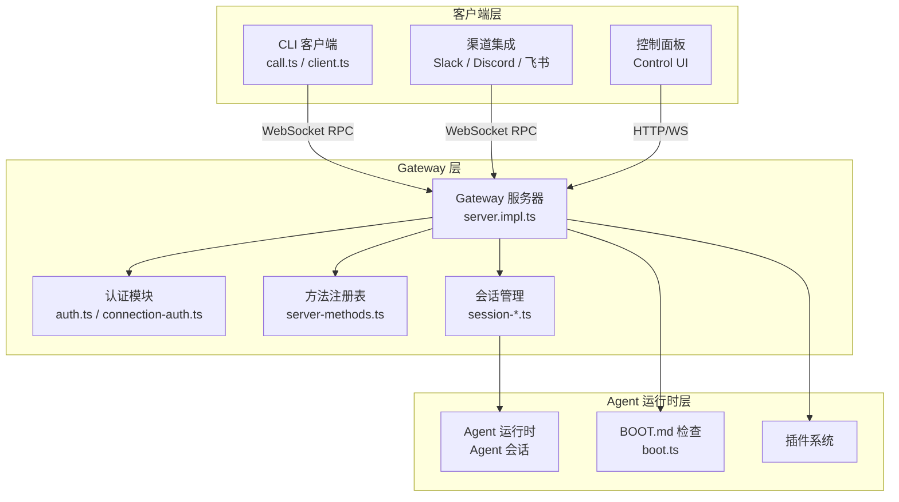
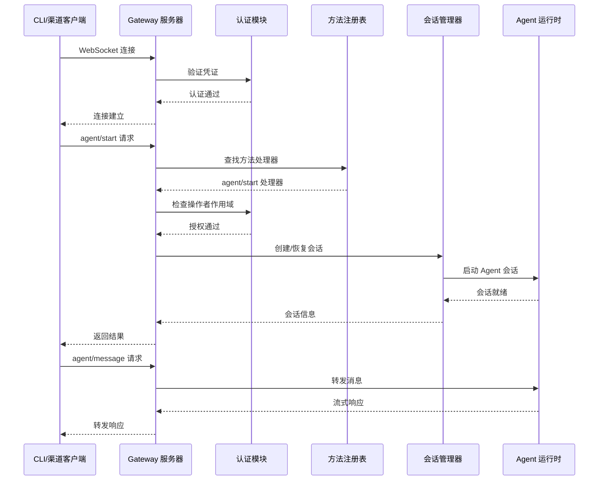
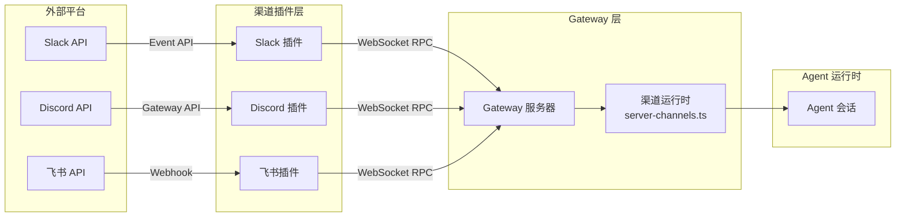

# 第七章：Gateway 与消息通信

本章深入 OpenClaw 的 Gateway（网关）系统。Gateway 是 OpenClaw 的**控制平面**（Control Plane），它通过 WebSocket 协议连接 CLI 客户端、后台服务和渠道集成，实现 Agent 的远程调用、会话管理和消息路由。

## 7.1 Gateway 概述

### 7.1.1 为什么需要 Gateway

OpenClaw 的 Agent 运行在本地进程中，但用户可能通过多种方式与 Agent 交互：

- **命令行界面**（CLI）：在终端中直接启动 Agent 会话
- **渠道集成**（Channel）：通过 Slack、Discord、飞书等 IM 平台与 Agent 对话
- **远程节点**：将 Agent 部署到远程机器上，通过 Gateway 转发请求
- **控制面板**（Control UI）：通过浏览器管理会话和配置

Gateway 充当这些客户端与 Agent 运行时之间的桥梁。它负责：

1. **连接管理**：接受 WebSocket 连接，处理认证、心跳和重连
2. **请求路由**：将 RPC 方法调用分发给对应的处理器
3. **会话管理**：创建、维护、恢复 Agent 会话
4. **权限控制**：通过操作者作用域（Operator Scope）和角色策略控制访问

### 7.1.2 架构概览

Gateway 的架构可以概括为三层：



Gateway 服务器作为 WebSocket 服务端，客户端通过 `gateway-protocol` 包定义的协议帧进行通信。服务器启动时会加载方法注册表，将 RPC 方法名映射到对应的处理器函数。

## 7.2 Gateway 服务器

### 7.2.1 懒加载入口

Gateway 服务器的入口点 `src/gateway/server.ts` 采用**懒加载**模式。它将 `server.impl.ts`（完整的实现，超过 1800 行）放在动态导入之后，使得轻量级调用者可以导入服务器类型和辅助函数，而不必加载完整的启动依赖图：

```typescript
// src/gateway/server.ts
async function loadServerImpl() {
  const startupStartedAt = performance.now();
  const before = performance.now();
  try {
    return await import("./server.impl.js");
  } finally {
    const now = performance.now();
    emitStartupTrace("gateway.server-impl-import", now - before, now - startupStartedAt);
  }
}

export async function startGatewayServer(
  ...args: Parameters<typeof import("./server.impl.js").startGatewayServer>
): ReturnType<typeof import("./server.impl.js").startGatewayServer> {
  const mod = await loadServerImpl();
  return await mod.startGatewayServer(...args);
}
```

### 7.2.2 服务器启动流程

`startGatewayServer` 函数（在 `server.impl.ts` 中）负责完整的服务器初始化。其核心流程包括：

1. **环境初始化**：规范化状态目录，确保 `openclaw` CLI 在 PATH 上
2. **配置加载**：读取 `OpenClawConfig`，解析网关配置（端口、认证、TLS 等）
3. **认证设置**：创建认证限速器，根据配置模式（token/password/device-auth）初始化认证策略
4. **方法注册表构建**：创建核心方法和插件方法描述符，构建完整的方法注册表
5. **HTTP/WebSocket 服务启动**：在指定端口上启动 HTTP 服务器，处理 WebSocket 升级
6. **插件加载**：加载插件，注册插件提供的方法和钩子
7. **会话管理初始化**：准备会话创建、恢复和压缩功能
8. **就绪状态发布**：标记服务器为就绪状态，开始接受客户端请求

服务器返回一个 `GatewayServer` 对象，包含 `close()` 方法用于优雅关闭：

```typescript
export async function startGatewayServer(
  port = 18789,
  opts: GatewayServerOptions = {},
): Promise<GatewayServer> {
  normalizeStateDirEnv(process.env);
  // ... 1800+ 行的实现
  return {
    close: async (optsLocal) => {
      try {
        markClosePreludeStarted();
        terminalSessions.disposeAll();
        await stopRegisteredGatewayLifetimeSidecars();
        await stopRegisteredPostReadySidecars();
        const { runGlobalGatewayStopSafely } = await import("../plugins/hook-runner-global.js");
        await runGlobalGatewayStopSafely({ ... });
        await runClosePrelude();
        await close(optsLocal);
      } finally {
        clearFallbackGatewayContextForServer();
      }
    },
  };
}
```

### 7.2.3 方法注册表

Gateway 的方法注册表（`src/gateway/server-methods.ts`）是所有 RPC 方法的中枢。它聚合了核心方法和插件方法，并为每个方法关联角色检查、作用域和速率限制。

方法处理器采用**懒加载模块**模式——每个方法族（如 `agent/*`、`sessions/*`）对应一个独立的模块，在首次调用时才加载：

```typescript
const loadAgentHandlers = lazyHandlerModule(
  () => import("./server-methods/agent.js"),
  (module) => module.agentHandlers,
);

const loadSessionsHandlers = lazyHandlerModule(
  () => import("./server-methods/sessions.js"),
  (module) => module.sessionsHandlers,
);
```

方法注册表支持以下能力：

| 能力 | 说明 |
|------|------|
| 核心方法描述符 | 内置的 Gateway 方法，如 `agent/start`、`session/create` |
| 插件方法描述符 | 插件通过 `registerGatewayMethod` 注册的方法 |
| 角色授权 | 基于 `operator`/`agent`/`admin` 角色的访问控制 |
| 操作者作用域 | 细粒度的权限作用域，如 `agent:start`、`session:read` |
| 控制平面审计 | 记录谁在何时调用了什么方法 |

### 7.2.4 认证系统

Gateway 的认证系统（`src/gateway/auth.ts`、`connection-auth.ts`）支持多种认证方式：

| 认证模式 | 说明 |
|----------|------|
| `token` | 静态令牌认证，通过配置文件或环境变量设置 |
| `password` | 密码认证，适用于 CLI 交互式登录 |
| `device_auth` | 设备认证，基于设备身份和签名，支持自动配对 |
| `tailscale` | Tailscale 网络认证，依赖 Tailscale 的节点身份 |
| `none` | 无认证模式，仅用于本地回环连接 |

认证流程分为两个阶段：

1. **连接认证**：客户端在 WebSocket 握手时提供凭证，服务器验证后建立连接
2. **请求授权**：每个 RPC 方法调用时，根据操作者作用域检查是否授权

## 7.3 Gateway 客户端

### 7.3.1 GatewayClient 封装

`src/gateway/client.ts` 是 Gateway 客户端的 OpenClaw 封装。它将 `gateway-client` 包的基础客户端与 OpenClaw 运行时依赖（设备身份、令牌存储、代理配置等）集成在一起：

```typescript
export class GatewayClient {
  #client: BaseGatewayClient;

  constructor(opts: GatewayClientOptions) {
    this.#client = new BaseGatewayClient({
      ...opts,
      clientVersion: opts.clientVersion ?? VERSION,
      hostDeps: createOpenClawGatewayClientHostDeps(opts.hostDeps),
    });
  }

  start(): void { this.#client.start(); }
  stop(): void { this.#client.stop(); }
  stopAndWait(opts?: { timeoutMs?: number }): Promise<void> { ... }
  request<T>(method: string, params?: unknown, opts?: GatewayClientRequestOptions): Promise<T> { ... }
}
```

`hostDeps` 将 OpenClaw 运行时能力注入到基础客户端中：

- `loadOrCreateDeviceIdentity`：加载或生成本地设备身份
- `signDevicePayload`：使用设备私钥签名负载
- `loadDeviceAuthToken` / `storeDeviceAuthToken` / `clearDeviceAuthToken`：管理设备认证令牌
- `beforeConnect`：确保代理路由在连接前激活
- `normalizeTlsFingerprint`：规范化 TLS 指纹

### 7.3.2 RPC 调用流程

`src/gateway/call.ts` 实现了完整的 RPC 调用流程 `callGateway()`。该函数是 Gateway 客户端的最高层抽象，处理认证、作用域解析和连接生命周期：

```typescript
export async function callGateway<T = Record<string, unknown>>(
  opts: CallGatewayOptions,
): Promise<T> {
  const callerMode = opts.mode ?? GATEWAY_CLIENT_MODES.BACKEND;
  const callerName = opts.clientName ?? GATEWAY_CLIENT_NAMES.GATEWAY_CLIENT;

  // CLI 模式使用 callGatewayCli
  if (callerMode === GATEWAY_CLIENT_MODES.CLI || callerName === GATEWAY_CLIENT_NAMES.CLI) {
    return await callGatewayCli(opts);
  }

  // 显式作用域
  if (Array.isArray(opts.scopes)) {
    return await callGatewayWithScopes({ ...opts, mode: callerMode, clientName: callerName }, opts.scopes);
  }

  // 最小权限作用域
  return await callGatewayLeastPrivilege({ ...opts, mode: callerMode, clientName: callerName });
}
```

完整的 RPC 调用生命周期包括以下步骤：

1. **解析上下文**：读取配置、URL 覆盖、认证信息
2. **解析凭证**：根据配置和显式参数解析 token/password
3. **构建连接详情**：确定目标 URL、TLS 指纹、超时时间
4. **创建客户端**：通过 `GatewayClient` 构造 WebSocket 连接
5. **握手**：等待 `onHelloOk` 回调，确认协议版本兼容
6. **执行请求**：通过 `client.request()` 发送 RPC 方法调用
7. **处理结果**：返回结果或转换为适当的错误类型

### 7.3.3 错误处理

Gateway 客户端定义了丰富的错误类型：

| 错误类型 | 说明 |
|----------|------|
| `GatewayTransportError` | 传输层错误（连接关闭、超时） |
| `GatewayCredentialsRequiredError` | 需要认证凭证但未提供 |
| `GatewayExplicitAuthRequiredError` | URL 覆盖需要显式认证 |
| `GatewayStoredDeviceAuthUnavailableError` | 存储的设备认证不可用 |
| `GatewayLocalBackendSharedAuthUnavailableError` | 本地后端共享认证不可用 |

## 7.4 Gateway Boot

### 7.4.1 BOOT.md 机制

`src/gateway/boot.ts` 实现了 **BOOT.md** 检查机制。`BOOT.md` 是放置在工作区根目录的 Markdown 文件，包含启动时检查指令。Gateway 在启动 Agent 会话前，会读取 BOOT.md 并在隔离的 Agent 会话中执行其中的指令。

```typescript
export async function runBootOnce(params: {
  cfg: OpenClawConfig;
  deps: CliDeps;
  workspaceDir: string;
  agentId?: string;
}): Promise<BootRunResult> {
  // 1. 读取 BOOT.md 文件
  const result = await loadBootFile(params.workspaceDir);
  if (result.status === "missing" || result.status === "empty") {
    return { status: "skipped", reason: result.status };
  }

  // 2. 构建启动提示词
  const message = buildBootPrompt(result.content ?? "");

  // 3. 在隔离会话中执行 Agent 命令
  await agentCommand({ message, sessionKey, sessionId, deliver: false, ... }, bootRuntime, params.deps);

  // 4. 返回执行结果
  return { status: "ran" };
}
```

### 7.4.2 启动提示词构建

`buildBootPrompt` 函数将 BOOT.md 内容包装在内部运行时上下文分隔符中，确保模型不会将 BOOT.md 内容泄露给用户：

```typescript
function buildBootPrompt(content: string) {
  const safeContent = escapeInternalRuntimeContextDelimiters(content);
  return [
    "You are running a boot check. Follow BOOT.md instructions exactly.",
    "",
    INTERNAL_RUNTIME_CONTEXT_BEGIN,
    OPENCLAW_RUNTIME_CONTEXT_NOTICE,
    "",
    "BOOT.md:",
    safeContent,
    INTERNAL_RUNTIME_CONTEXT_END,
    "",
    "If BOOT.md asks you to send a message, use the message tool...",
    `After sending with the message tool, reply with ONLY: ${SILENT_REPLY_TOKEN}.`,
    `If nothing needs attention, reply with ONLY: ${SILENT_REPLY_TOKEN}.`,
  ].join("\n");
}
```

### 7.4.3 会话映射管理

Boot 会话使用临时会话映射，在执行完毕后需要恢复原有的会话映射。`preserveTemporarySessionMapping` 确保 Boot 会话不会污染主会话的映射状态：

```
主会话映射 ──→ 保存快照 ──→ 创建 Boot 临时映射 ──→ 执行 Agent ──→ 恢复快照
```

## 7.5 通过 Gateway 进行 Agent 调度

### 7.5.1 工作流

Gateway 在 Agent 调度中扮演核心角色。当 CLI 用户或渠道发起一个 Agent 请求时，完整的调度流程如下：



### 7.5.2 子进程 Agent 调度

当 Gateway 启动 Agent 时，Agent 可能运行在子进程中。Gateway 通过 `server-sidecar-startup-mode.ts` 管理和调度子进程 Agent：

1. **Gate 进程**：运行 Gateway 服务器的主进程
2. **子进程 Agent**：由 Gateway 启动的独立 Agent 进程，每个 Agent 会话一个
3. **进程间通信**：通过 Gateway 的 WebSocket 协议进行 RPC 通信

子进程方式的优势：
- **隔离性**：每个 Agent 运行在独立进程中，故障不会相互影响
- **资源管理**：可以独立限制每个 Agent 的 CPU/内存使用
- **热更新**：重启 Agent 时不影响 Gateway 主进程

### 7.5.3 远程 Agent 调度

Gateway 支持远程模式（`gateway.mode = "remote"`），将 Agent 调度到远程节点上：

```
CLI ──→ Gateway（本地）──→ Gateway（远程）──→ Agent 运行时
```

远程模式通过 `gateway.remote.url` 配置远程 Gateway 地址，所有 RPC 请求通过 TLS 加密的 WebSocket 转发到远程节点。

## 7.6 渠道集成

### 7.6.1 渠道架构

渠道集成是 Gateway 的重要扩展点。所有渠道（Slack、Discord、飞书等）都以插件形式实现，通过 Gateway 的 WebSocket 协议与 Agent 运行时通信。

渠道集成的架构如下：



### 7.6.2 渠道消息路由

渠道消息的路由流程：

1. **消息接收**：渠道插件通过平台 API（如 Slack Event API、Discord Gateway API）接收消息
2. **消息转换**：插件将平台消息转换为 OpenClaw 内部消息格式
3. **RPC 调用**：插件通过 Gateway 客户端调用 `chat/send` 方法
4. **消息分发**：Gateway 将消息路由到对应的 Agent 会话
5. **响应返回**：Agent 处理后，通过 Gateway 将响应返回给渠道插件
6. **消息发送**：渠道插件将响应发送到平台

### 7.6.3 渠道插件生命周期

渠道插件通过 Gateway 的插件系统加载和管理。每个渠道插件需要实现：

- **ChannelPlugin 接口**：定义渠道的基本操作（发送消息、获取频道信息等）
- **Setup 入口**：可选，用于渠道的初始化配置
- **Runtime 入口**：运行时入口，处理消息的接收和发送

渠道插件的生命周期如下：

```
发现 → 验证 → 加载配置 → 注册渠道 → 建立连接 → 处理消息 → 断开连接
```

### 7.6.4 操作者作用域

渠道集成使用操作者作用域（Operator Scope）来控制权限。每个 RPC 方法都可以关联所需的作用域，Gateway 在调用前检查当前操作者是否拥有该作用域。

常见的作用域包括：

| 作用域 | 说明 |
|--------|------|
| `agent:start` | 启动 Agent 会话 |
| `agent:message` | 向 Agent 发送消息 |
| `session:read` | 读取会话信息 |
| `session:write` | 修改会话状态 |
| `admin:*` | 管理员操作（所有权限） |

## 7.7 总结

Gateway 是 OpenClaw 的**通信中枢**，它通过 WebSocket 协议将 CLI 客户端、渠道集成和 Agent 运行时连接在一起。本章我们学习了：

- **Gateway 服务器**的懒加载入口和启动流程
- **方法注册表**如何聚合核心方法和插件方法
- **认证系统**支持多种认证模式（token/password/device-auth）
- **Gateway 客户端**如何处理 RPC 调用和错误
- **BOOT.md 机制**在工作区启动时执行检查
- **Agent 调度**通过 Gateway 进行子进程和远程节点调度
- **渠道集成**如何通过插件和 Gateway 连接外部 IM 平台

Gateway 的设计体现了"控制平面"的理念——它不处理具体的 Agent 逻辑，而是负责连接管理、请求路由和权限控制，将 Agent 运行时与外部世界安全地连接起来。

---

上一章（[第 6 章](ch06-llm-integration/README.md)）讲解了 Agent 与 LLM 提供商的通信链路，本章讲解了 Agent 与外部客户端/渠道的通信链路。下一章将介绍 **插件 SDK**——如何通过注册机制扩展 Agent 的能力（Provider、渠道、工具、钩子等）。

> 🔗 术语呼应：本章提到的 **渠道插件** 与第 8 章的 `registerChannel` API 对应；**插件方法** 通过第 8 章的 `register` 阶段注入到 Gateway 的方法注册表中；**BOOT.md** 的执行由 Agent 命令协调器驱动（第 4 章 `agent-command.ts`）。