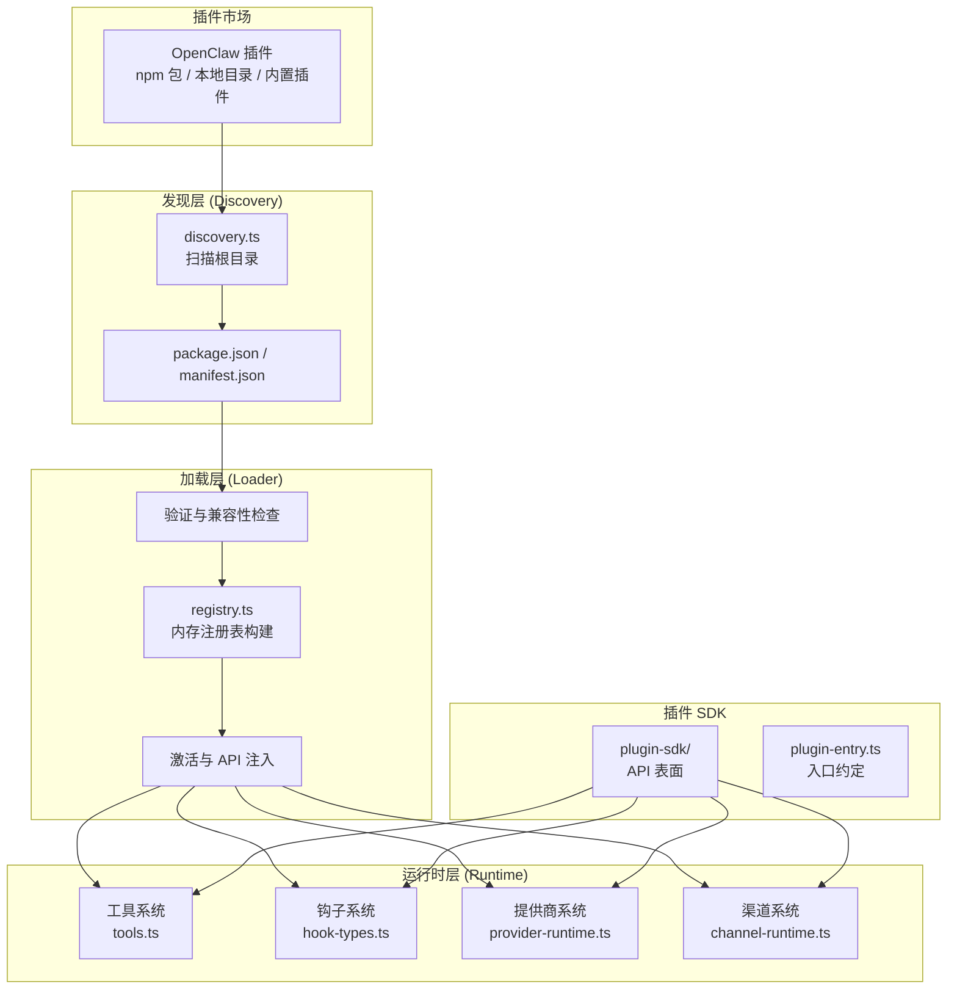
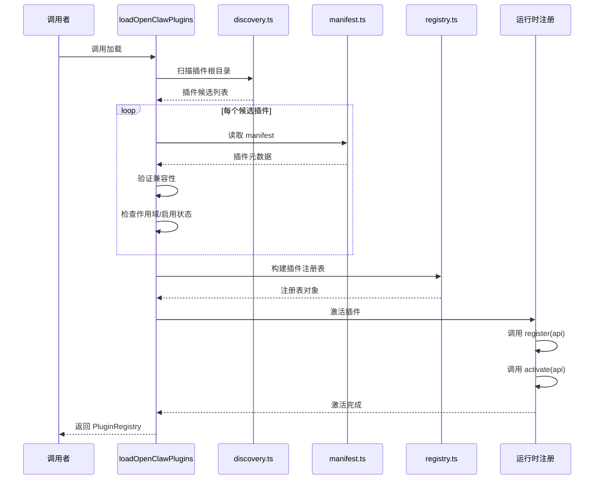

# 第八章：插件 SDK 系统

本章深入 OpenClaw 的插件 SDK（Plugin SDK）系统。插件是 OpenClaw 的**扩展机制**，通过插件 SDK，开发者可以自由扩展 Agent 的能力——添加新的 LLM 提供商、集成新的 IM 渠道、注册自定义工具、或在 Agent 生命周期的各个阶段注入自定义逻辑。

## 8.1 插件架构概览

### 8.1.1 为什么需要插件

OpenClaw 的核心设计原则之一是**可扩展性**。插件系统允许在不修改核心代码的情况下：

- 添加新的 LLM 提供商（如自定义的 OpenAI 兼容 API）
- 集成新的 IM 平台（如 Slack、Discord、飞书）
- 注册新的 Agent 工具（如搜索、代码执行、文件操作）
- 在 Agent 生命周期中注入钩子（如消息过滤、日志记录、审计）

### 8.1.2 整体架构

插件系统由以下几个层次组成：



### 8.1.3 插件类型

OpenClaw 定义了多种插件类型（`PluginKind`），每种类型对应不同的扩展点：

| 插件类型 | 说明 | 注册 API |
|----------|------|----------|
| `provider` | LLM 提供商插件 | `registerProvider` |
| `channel` | 渠道插件 | `registerChannel` |
| `tool` | 工具插件 | `registerTool` |
| `hook` | 钩子插件 | `registerHook` |
| `memory` | 记忆插件 | `registerMemoryCapability` |
| `cli` | CLI 扩展插件 | `registerCli` / `registerCommand` |
| `http` | HTTP 路由插件 | `registerHttpRoute` |
| `agent_harness` | Agent 执行容器插件 | `registerAgentHarness` |
| `compaction` | 上下文压缩插件 | `registerCompactionProvider` |

一个插件可以同时属于多个类型（如一个渠道插件也可以注册工具），通过 `kind` 字段声明。

## 8.2 插件类型与契约

### 8.2.1 OpenClawPlugin 接口

插件对外暴露的入口是一个符合 `OpenClawPlugin` 契约的对象，定义在 `src/plugins/types.ts` 中：

```typescript
export type OpenClawPlugin = {
  id?: string;
  name?: string;
  description?: string;
  version?: string;
  kind?: PluginKind | PluginKind[];
  configSchema?: OpenClawPluginConfigSchema;
  reload?: OpenClawPluginReloadRegistration;
  nodeHostCommands?: OpenClawPluginNodeHostCommand[];
  securityAuditCollectors?: OpenClawPluginSecurityAuditCollector[];
  register?: (api: OpenClawPluginApi) => void;
  activate?: (api: OpenClawPluginApi) => void;
};
```

核心字段说明：

| 字段 | 说明 |
|------|------|
| `id` | 插件唯一标识符，如 `@openclaw/slack` |
| `kind` | 插件类型声明，决定插件在注册表中被归类到哪个集合 |
| `configSchema` | 配置 Schema，支持 Zod 风格的 `safeParse` 或轻量级 `validate` |
| `register` | 注册阶段回调，插件在此通过 API 注册工具、钩子、渠道等 |
| `activate` | 激活阶段回调，在注册完成后调用，可执行初始化逻辑 |
| `reload` | 配置重载处理器，在配置变更时调用 |
| `nodeHostCommands` | 节点主机命令，用于定义远程节点可执行的命令 |

### 8.2.2 OpenClawPluginApi

插件通过 `OpenClawPluginApi` 与 OpenClaw 运行时交互。API 对象包含了丰富的注册方法：

```typescript
export type OpenClawPluginApi = {
  id: string;
  name: string;
  version?: string;
  source: string;
  rootDir?: string;
  registrationMode: PluginRegistrationMode;
  config: OpenClawConfig;
  pluginConfig?: Record<string, unknown>;
  runtime: PluginRuntime;
  logger: PluginLogger;

  // 工具注册
  registerTool(options: OpenClawPluginToolOptions): void;
  registerTool(options: OpenClawPluginToolOptions, factory: OpenClawPluginToolFactory): void;

  // 钩子注册
  registerHook(hook: PluginHookRegistration): void;
  on(event: PluginHookName, handler: (...args: any[]) => any): void;

  // 渠道注册
  registerChannel(channel: ChannelPlugin, options?: ChannelPluginOptions): void;

  // 提供商注册
  registerProvider(provider: ProviderPlugin): void;
  registerModelCatalogProvider(provider: UnifiedModelCatalogProviderPlugin): void;
  registerEmbeddingProvider(provider: EmbeddingProviderAdapter): void;
  registerSpeechProvider(provider: SpeechProviderPlugin): void;

  // HTTP 路由
  registerHttpRoute(route: OpenClawPluginHttpRouteRegistration): void;

  // Gateway 方法
  registerGatewayMethod(method: string, handler: GatewayRequestHandler): void;

  // CLI 注册
  registerCli(registrar: OpenClawPluginCliRegistrar): void;
  registerCommand(command: OpenClawPluginCommandDefinition): void;

  // 会话与生命周期
  registerSessionExtension(extension: PluginSessionExtensionRegistration): void;
  registerRuntimeLifecycle(lifecycle: PluginRuntimeLifecycleRegistration): void;
  enqueueNextTurnInjection(injection: PluginNextTurnInjection): void;

  // 其他能力
  registerReload(reload: OpenClawPluginReloadRegistration): void;
  registerNodeHostCommand(command: OpenClawPluginNodeHostCommand): void;
  registerService(service: OpenClawPluginService): void;
  registerAgentHarness(harness: AgentHarness): void;
  registerAgentToolResultMiddleware(middleware: AgentToolResultMiddleware): void;
  registerInteractiveHandler(handler: PluginInteractiveHandlerRegistration): void;
  registerConfigMigration(migration: PluginConfigMigration): void;
  registerContextEngine(engine: ContextEngineRegistration): void;
  registerCompactionProvider(provider: CompactionProviderRegistration): void;
  registerDetachedTaskRuntime(runtime: DetachedTaskRuntimeRegistration): void;
  // ... 更多注册方法
};
```

API 还提供了**外观模式**（Facade）的嵌套访问器，通过 `api.agent`、`api.lifecycle`、`api.session`、`api.runContext` 等属性组织相关功能。

### 8.2.3 PluginHookHandlerMap

钩子系统是插件最强大的扩展点之一。`PluginHookHandlerMap` 定义了所有可用的钩子类型及其签名：

```typescript
export type PluginHookHandlerMap = {
  agent_turn_prepare: (
    event: PluginAgentTurnPrepareEvent,
    ctx: PluginHookAgentContext,
  ) => Promise<PluginAgentTurnPrepareResult | void> | PluginAgentTurnPrepareResult | void;

  before_model_resolve: (
    event: PluginHookBeforeModelResolveEvent,
    ctx: PluginHookAgentContext,
  ) => Promise<PluginHookBeforeModelResolveResult | void> | PluginHookBeforeModelResolveResult | void;

  before_prompt_build: (
    event: PluginHookBeforePromptBuildEvent,
    ctx: PluginHookAgentContext,
  ) => Promise<PluginHookBeforePromptBuildResult | void> | PluginHookBeforePromptBuildResult | void;

  before_agent_reply: (
    event: PluginHookBeforeAgentReplyEvent,
    ctx: PluginHookAgentContext,
  ) => Promise<PluginHookBeforeAgentReplyResult | void> | PluginHookBeforeAgentReplyResult | void;

  model_call_started: (
    event: PluginHookModelCallStartedEvent,
    ctx: PluginHookAgentContext,
  ) => Promise<void> | void;

  model_call_ended: (
    event: PluginHookModelCallEndedEvent,
    ctx: PluginHookAgentContext,
  ) => Promise<void> | void;

  // ... 更多钩子
};
```

所有可用的钩子名称：

```
before_model_resolve, agent_turn_prepare, before_prompt_build,
before_agent_start, before_agent_reply, model_call_started,
model_call_ended, llm_input, llm_output, before_agent_finalize,
agent_end, before_compaction, after_compaction, before_reset,
inbound_claim, channel_pairing_requested, message_received,
message_sending, reply_payload_sending, message_sent,
before_tool_call, after_tool_call, tool_result_persist,
before_message_write, session_start, session_end,
subagent_spawned, subagent_ended, gateway_start, gateway_stop,
heartbeat_prompt_contribution, cron_changed, reply_dispatch,
before_agent_run, resolve_exec_env
```

## 8.3 插件工具注册

### 8.3.1 工具元数据

`src/plugins/tools.ts` 实现了插件工具的核心管理逻辑。每个插件注册的工具都会关联一个 `PluginToolMeta` 元数据对象：

```typescript
export type PluginToolMeta = {
  pluginId: string;
  optional: boolean;
  replaySafe?: boolean;
  trustedLocalMedia?: boolean;
  mcp?: PluginToolMcpMeta;
};
```

工具元数据通过 `WeakMap` 与工具实例关联，确保不会泄漏或影响工具的正常使用：

```typescript
const pluginToolMeta = new WeakMap<AnyAgentTool, PluginToolMeta>();

export function setPluginToolMeta(tool: AnyAgentTool, meta: PluginToolMeta): void {
  pluginToolMeta.set(tool, meta);
}

export function getPluginToolMeta(tool: AnyAgentTool): PluginToolMeta | undefined {
  return pluginToolMeta.get(tool);
}
```

### 8.3.2 工具工厂模式

插件不直接注册工具实例，而是注册**工具工厂**（`OpenClawPluginToolFactory`）。工厂是一个函数，在需要时被调用以创建工具实例：

```typescript
export type PluginToolFactoryResult = AnyAgentTool | AnyAgentTool[] | null | undefined;

// 工具注册条目
export type PluginToolRegistration = {
  pluginId: string;
  pluginName?: string;
  factory: OpenClawPluginToolFactory;  // 工厂函数
  names: string[];
  declaredNames?: string[];
  optional: boolean;
  source: string;
  rootDir?: string;
};
```

这种工厂模式的优势：

- **懒加载**：工具只在需要时创建，减少启动时间
- **按需配置**：工厂可以访问运行时上下文，根据配置创建不同的工具实例
- **错误隔离**：单个工具工厂的失败不会影响其他工具

### 8.3.3 工具作用域包装

插件工具在执行时，需要确保在正确的插件作用域内运行。`wrapPluginToolCallbacks` 函数通过 Proxy 为工具的 `execute` 和 `prepareArguments` 方法添加作用域包装：

```typescript
function wrapPluginToolCallbacks(entry: PluginToolRegistration, tool: AnyAgentTool): AnyAgentTool {
  const scopedExecute = (toolCallId, params, signal, onUpdate) =>
    runWithPluginToolScope(entry, () =>
      Reflect.apply(tool.execute, tool, [toolCallId, params, signal, onUpdate])
    );

  const wrapped = new Proxy<AnyAgentTool>(tool, {
    get(target, prop) {
      if (prop === "execute") return scopedExecute;
      return Reflect.get(target, prop, target);
    },
    // ...
  });

  copyPluginToolMeta(tool, wrapped);
  return wrapped;
}
```

### 8.3.4 工具描述符缓存

为了优化性能，插件工具的描述符（用于向 LLM 展示的工具定义）支持缓存。`tool-descriptor-cache.ts` 实现了基于配置键的缓存机制：

```typescript
export function buildPluginToolDescriptorCacheKey(config: OpenClawConfig): string { ... }
export function readCachedPluginToolDescriptors(key: string): CachedPluginToolDescriptor[] | undefined { ... }
export function writeCachedPluginToolDescriptors(key: string, descriptors: CachedPluginToolDescriptor[]): void { ... }
```

缓存的键基于配置的快照生成，当配置发生变化时缓存自动失效。

### 8.3.5 工具允许/拒绝列表

插件工具支持通过配置进行细粒度的访问控制。`normalizeAllowlist` 和 `normalizeDenylist` 函数处理允许和拒绝列表：

- **允许列表**：只在列表中的工具可见
- **拒绝列表**：匹配模式（支持 glob）的工具被隐藏
- **可选工具**：标记为 `optional` 的工具在 Factory 失败时不会导致整个插件加载失败

## 8.4 插件加载器

### 8.4.1 加载流程

`src/plugins/loader.ts` 实现了插件的完整加载流程，这是插件系统中最复杂的文件（超过 2000 行）。`loadOpenClawPlugins` 函数是加载的入口：

```typescript
export function loadOpenClawPlugins(options: PluginLoadOptions = {}): PluginRegistry {
  // 1. 解析插件 ID 作用域
  const requestedOnlyPluginIds = normalizePluginIdScope(options.onlyPluginIds);
  const requestedOnlyPluginIdSet = createPluginIdScopeSet(requestedOnlyPluginIds);

  // 2. 如果作用域为空，返回空注册表
  if (requestedOnlyPluginIdSet && requestedOnlyPluginIdSet.size === 0) {
    const emptyRegistry = createEmptyPluginRegistry();
    if (options.activate !== false) {
      clearActivatedPluginRuntimeState();
      activatePluginRegistry(emptyRegistry, ...);
    }
    return emptyRegistry;
  }

  // 3. 继续完整的加载流程...
}
```

完整的加载流程如下：



### 8.4.2 插件发现

`src/plugins/discovery.ts` 负责插件的发现。`discoverOpenClawPlugins` 函数从多个根目录扫描插件候选：

1. **内置插件**：从 OpenClaw 安装目录的 `bundled` 目录加载
2. **工作区插件**：从工作区 `.openclaw/plugins` 目录加载
3. **全局插件**：从用户全局目录加载
4. **npm 包**：通过 `package.json` 中的 `openclaw` 字段声明
5. **Bundle 包**：从打包的 bundle 文件加载

```typescript
export function discoverOpenClawPlugins(params: {
  workspaceDir?: string;
  extraPaths?: string[];
  installRecords?: Record<string, PluginInstallRecord>;
  ownershipUid?: number | null;
  env?: NodeJS.ProcessEnv;
}): PluginDiscoveryResult {
  const roots = resolvePluginSourceRoots({ workspaceDir: workspaceRoot, env });
  // 扫描每个根目录，收集插件候选
  // 返回 { candidates: PluginCandidate[], diagnostics: PluginDiagnostic[] }
}
```

### 8.4.3 清单与元数据

插件的元数据通过 `package.json` 中的 `openclaw` 字段或独立的 `openclaw-plugin.json` 清单文件声明。`src/plugins/manifest.ts` 定义了清单的解析逻辑：

```typescript
// package.json 示例
{
  "name": "@openclaw/plugin-slack",
  "openclaw": {
    "id": "@openclaw/slack",
    "kind": ["channel", "tool"],
    "entry": "./dist/index.js",
    "setupEntry": "./dist/setup.js",
    "configSchema": { ... }
  }
}
```

### 8.4.4 缓存策略

插件加载器实现了多级缓存策略，以优化启动性能：

- **注册表缓存**：`PluginLoaderCacheState` 缓存已构建的注册表，基于配置快照的哈希值
- **模块加载器缓存**：`PluginModuleLoaderCache` 缓存已加载的插件模块
- **工具描述符缓存**：缓存插件工具的描述符，避免重复构建

```typescript
const pluginLoaderCacheState = new PluginLoaderCacheState<CachedPluginState>(
  MAX_PLUGIN_REGISTRY_CACHE_ENTRIES,  // 128
);
```

### 8.4.5 错误处理与恢复

插件加载器设计了完善的错误处理机制：

- **单个插件失败不影响其他插件**：`recordPluginError` 记录错误，但继续加载其他插件
- **可选工具**：标记为 `optional` 的工具在 Factory 失败时仅记录警告
- **PluginLoadFailureError**：当调用者要求 `throwOnLoadError` 时，聚合所有失败信息抛出
- **诊断信息**：`PluginDiagnostic` 类型记录加载过程中的警告和错误

## 8.5 插件注册表

### 8.5.1 注册表结构

`src/plugins/registry.ts` 构建了插件运行时注册表。`PluginRegistry` 是一个包含所有注册信息的巨型对象（`registry-types.ts` 中定义）：

```typescript
export type PluginRegistry = {
  plugins: PluginRecord[];                    // 插件记录
  tools: PluginToolRegistration[];            // 工具工厂
  hooks: HookEntry[];                         // 钩子处理器
  typedHooks: TypedPluginHookRegistration[];  // 类型化钩子
  channels: ChannelPluginRegistration[];      // 渠道插件
  providers: ProviderPluginRegistration[];    // 提供商
  modelCatalogProviders: ModelCatalogProviderRegistration[];
  embeddingProviders: EmbeddingProviderRegistration[];
  cliBackends: CliBackendRegistration[];
  gatewayHandlers: Record<string, GatewayRequestHandler>;  // Gateway 方法
  gatewayMethodDescriptors: GatewayMethodDescriptor[];
  httpRoutes: HttpRouteRegistration[];
  // ... 更多注册集合
};
```

### 8.5.2 空注册表

在插件加载完成之前，系统使用 `createEmptyPluginRegistry()` 创建一个所有字段为空数组/空对象的注册表。这确保了消费者代码不需要处理 `undefined` 注册表：

```typescript
export function createEmptyPluginRegistry(): PluginRegistry {
  return {
    plugins: [], tools: [], hooks: [], typedHooks: [],
    channels: [], providers: [], modelCatalogProviders: [],
    gatewayHandlers: {}, gatewayMethodDescriptors: [],
    // ... 所有字段初始化
  };
}
```

### 8.5.3 注册表快照

在加载过程中，插件加载器会创建注册表的快照（`snapshotPluginRegistry`），用于缓存比较和热重载：

```typescript
function snapshotPluginRegistry(registry: PluginRegistry): PluginRegistrySnapshot {
  return {
    arrays: {
      tools: [...registry.tools],
      hooks: [...registry.hooks],
      channels: [...registry.channels],
      // ... 深度复制所有数组
    },
    gatewayHandlers: { ...registry.gatewayHandlers },
    gatewayMethodDescriptors: [...registry.gatewayMethodDescriptors],
  };
}
```

## 8.6 插件 API 构建

### 8.6.1 API 构建器

`src/plugins/api-builder.ts` 中的 `buildPluginApi` 函数为每个插件构建独立的 API 对象。每个插件获得：

- **独立的配置视图**：`api.pluginConfig` 包含该插件的配置节
- **独立的运行时**：`api.runtime` 提供运行时辅助方法
- **独立的日志记录器**：`api.logger` 带有插件 ID 前缀的日志输出
- **注册方法**：`api.registerTool`、`api.registerHook` 等

### 8.6.2 API 外观

`src/plugins/api-facades.ts` 通过 `attachPluginApiFacades` 为 API 添加了嵌套的外观结构：

```typescript
// 通过外观访问的 API 方法
api.agent.sendMessage(...)       // 发送消息到 Agent
api.agent.getMessages(...)       // 获取会话消息
api.lifecycle.onStop(...)        // 注册停止回调
api.session.get(...)             // 获取会话状态
api.session.set(...)             // 设置会话状态
api.runContext.get(...)          // 获取运行上下文
```

### 8.6.3 生命周期方法

API 对象中的方法分为两类：

- **注册期方法**：只能在 `register()` 回调中调用（如 `registerTool`、`registerHook`）
- **运行时方法**：在插件激活后也可调用（如 `enqueueNextTurnInjection`、`emitAgentEvent`）

`isLateCallablePluginApiMethod` 函数区分了这两类方法。

## 8.7 插件运行时

### 8.7.1 PluginRuntime

`PluginRuntime` 是插件在运行时可以访问的宿主环境，定义在 `src/plugins/runtime/types.ts` 中：

```typescript
export type PluginRuntime = {
  version: string;
  gateway: GatewayRuntime;
  config: ConfigRuntime;
  agent: AgentRuntime;
  subagent: SubagentRuntime;
  system: SystemRuntime;
  media: MediaRuntime;
  mediaUnderstanding: MediaUnderstandingRuntime;
  tts: TtsRuntime;
  stt: SttRuntime;
  channel: ChannelRuntime;
  events: EventsRuntime;
  logging: LoggingRuntime;
  state: StateRuntime;
  modelAuth: ModelAuthRuntime;
  imageGeneration: ImageGenerationRuntime;
  videoGeneration: VideoGenerationRuntime;
  musicGeneration: MusicGenerationRuntime;
  llm: LlmRuntime;
};
```

每个运行时域提供了一组辅助方法。例如：

- `runtime.gateway.request(method, params)`：通过 Gateway 发起 RPC 请求
- `runtime.config.get(key)`：获取配置值
- `runtime.agent.sendMessage(message)`：向当前 Agent 发送消息
- `runtime.state.getStore(namespace)`：获取插件状态存储

### 8.7.2 运行时作用域

插件运行时为每个插件维护独立的作用域，确保插件之间的隔离性。`withPluginRuntimePluginScope` 函数在调用插件方法时设置正确的运行作用域：

```typescript
export function runWithPluginToolScope(entry: PluginToolRegistration, run: () => T): T {
  return withPluginRuntimePluginScope(
    { pluginId: entry.pluginId, ...(entry.source ? { pluginSource: entry.source } : {}) },
    run,
  );
}
```

### 8.7.3 状态存储

插件可以使用 `plugin-state` 系统进行持久化状态存储。`registerPluginStateStore` 为每个插件创建独立的键值存储：

- **同步存储**：`PluginStateSyncKeyedStore`，适用于简单的同步操作
- **异步存储**：`PluginStateKeyedStore`，适用于需要 I/O 的操作

## 8.8 编写一个简单插件

### 8.8.1 插件入口

一个最小化的插件只需要导出符合 `OpenClawPlugin` 契约的对象：

```typescript
// my-plugin/src/index.ts
import type { OpenClawPlugin, OpenClawPluginApi } from "openclaw/plugin-sdk";

export default {
  id: "my-plugin",
  name: "My Plugin",
  version: "1.0.0",
  kind: ["tool", "hook"],

  register(api: OpenClawPluginApi) {
    // 注册一个工具
    api.registerTool({
      name: "my_tool",
      description: "My custom tool",
      inputSchema: {
        type: "object",
        properties: {
          message: { type: "string" },
        },
      },
    }, async (ctx) => {
      return {
        execute: async (toolCallId, params) => {
          return `Hello from plugin: ${params.message}`;
        },
      };
    });

    // 注册一个钩子
    api.registerHook({
      hook: "before_agent_reply",
      handler: async (event, ctx) => {
        api.logger.info(`Agent about to reply`);
        // 可以修改回复内容
      },
    });
  },

  activate(api: OpenClawPluginApi) {
    api.logger.info("Plugin activated!");
  },
} satisfies OpenClawPlugin;
```

### 8.8.2 package.json 声明

插件的 `package.json` 需要通过 `openclaw` 字段声明插件元数据：

```json
{
  "name": "my-plugin",
  "version": "1.0.0",
  "openclaw": {
    "id": "my-plugin",
    "kind": ["tool", "hook"],
    "entry": "./dist/index.js"
  }
}
```

### 8.8.3 安装与加载

将插件安装到工作区后，OpenClaw 会自动发现并加载它：

```bash
# 安装插件
openclaw plugins install my-plugin

# 查看已安装的插件
openclaw plugins list

# 启用/禁用插件
openclaw plugins enable my-plugin
openclaw plugins disable my-plugin
```

## 8.9 总结

插件 SDK 是 OpenClaw 可扩展性的核心。本章我们学习了：

- **插件架构**由发现层、加载层和运行时层组成
- **插件类型**包括 provider、channel、tool、hook 等多种扩展点
- **OpenClawPlugin 接口**定义了插件入口契约（register/activate）
- **OpenClawPluginApi** 提供了丰富的注册方法
- **PluginHookHandlerMap** 定义了 30+ 个生命周期钩子
- **工具注册**使用工厂模式、作用域包装和描述符缓存
- **插件加载器**实现了发现、验证、构建注册表和激活的完整流程
- **插件注册表**是运行时所有插件信息的中心存储
- **插件运行时**为每个插件提供独立的运行环境

插件系统的设计体现了"约定优于配置"和"关注点分离"的原则——插件开发者只需要关注自己插件的逻辑，而插件的发现、加载、生命周期管理由框架统一处理。